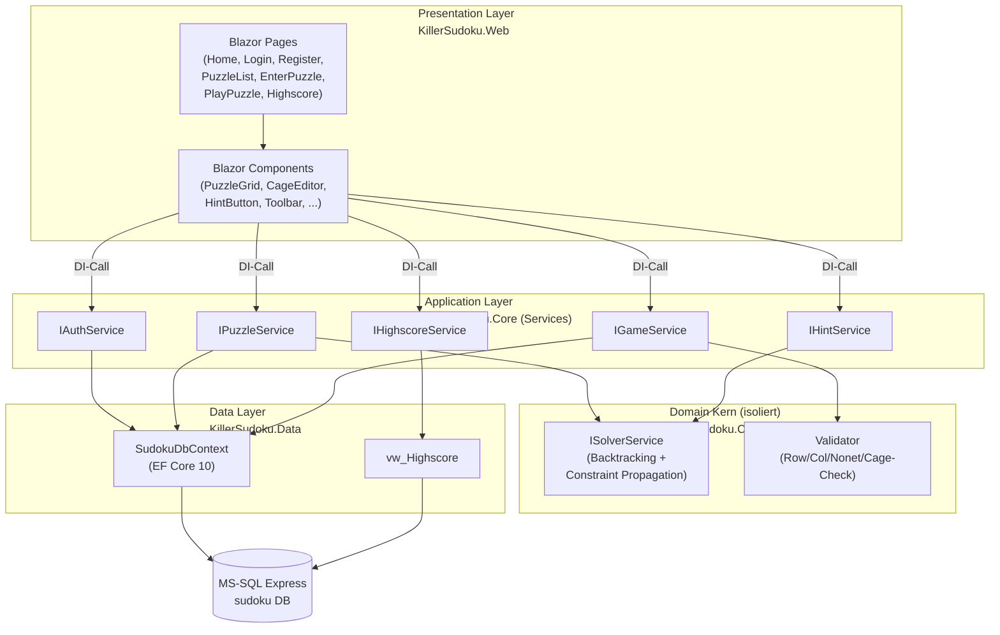
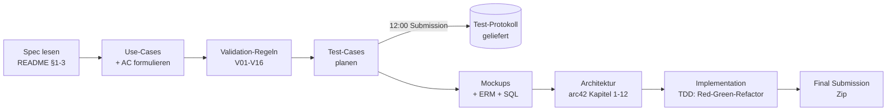

# 4 Lösungsstrategie

> arc42 v8.2 · Kapitel 4 · Killer Sudoku
> Bezug: [`00-README.md`](00-README.md) (Index) · [`../use-cases.md`](../use-cases.md) · [`../functionality.md`](../functionality.md) · [`../validation.md`](../validation.md) · [`../erm.md`](../erm.md) · [`../../skillsbattle2026_1.1.md`](../../skillsbattle2026_1.1.md)

Dieses Kapitel fasst die fundamentalen Entscheidungen zusammen, die alle nachfolgenden Kapitel tragen. Die Aufgabenstellung gibt **kein** spezifisches Framework vor (siehe §1.3 "free to build the database schema", §1 "your task is to plan, implement, and test"). Damit sind Technologie-Wahl und Top-Level-Zerlegung explizit Architektur-Entscheidungen — sie sind hier dokumentiert.

---

## 4.1 Technologie-Entscheidungen

Die folgende Tabelle ordnet jede zentrale Anforderung aus dem Aufgaben-README einer technischen Lösung zu. Vollständige Begründung in [Kapitel 9 — Architekturentscheidungen](09-decisions.md) (TBD).

| Anforderung (Quelle) | Gewählte Lösung | Begründung |
|----------------------|-----------------|------------|
| "login is required" (UC02/UC03) | **ASP.NET Core Identity** (Cookie-Auth) | Built-in für .NET 10, PBKDF2-Hashing, CSRF/XSRF-Token frei Haus, deckt [V03](../validation.md#v03--passwort-uc02-uc03)/[V15](../validation.md#v15--csrf-alle-post-endpoints) Defense-in-Depth |
| "stored in the database" (UC04) | **Microsoft SQL Server Express** + Entity Framework Core 10 | README erlaubt explizit MS-SQL oder MySQL; MS-SQL Express ist lokal lizenzkostenfrei, native T-SQL-Constraints (CHECK/UNIQUE/Filtered Index/Trigger) tragen DB-Layer-Verteidigung aus [`erm.md`](../erm.md) |
| "must be calculated with an algorithm" (UC04/UC11) | **Reiner C#-Solver** (`ISolverService`) als isolierter Domain-Kern ohne Framework-Abhängigkeit | Pure Logik → Unit-testbar ohne DB/UI; Backtracking + Constraint-Propagation; siehe [`functionality.md`](../functionality.md) Service-Block |
| "solution must be unique" (§1) | Solver bricht nach dem **zweiten** gefundenen Pfad ab → `Solutions ∈ {0,1,2}` ([V07](../validation.md#v07--puzzle-solvability-uc05)) | Performance-Begrenzung (AC11.2: <2 s); 2 ist Marker für "≥2" |
| Interaktives Grid (UC04, UC06, UC07, UC14) | **Blazor Server** (Razor Components + SignalR) | Server-rendered: Solver/Validierung läuft serverseitig (kein clientseitiges Cheaten möglich), `[Authorize]`-Attribut für Routen, kein zweites SPA-Frontend-Projekt nötig |
| "test cases ... unit tests ... test framework" (§3) | **xUnit** + **bUnit** (Component-Tests) + **EF Core InMemory / Testcontainers** | Standard für .NET; bUnit erlaubt Blazor-Komponenten-Tests ohne Browser; siehe [`test-protocol.md`](../test-protocol.md) |
| Validation-Defense (V01–V16) | **3 Layer**: Client (Blazor `EditForm`/Annotations) → Server (`IXxxService`) → DB (CHECK/UNIQUE/Trigger) | "Defense in Depth" aus [`validation.md`](../validation.md) Header — kritische Regeln auf mind. 2 Layern |
| Sum-Check "405" (§2.3) | **Fast-Fail in `IGameService.CheckSolutionAsync`** vor Voll-Algorithmus ([V09](../validation.md#v09--sum-check-lösung-uc09)) | README §2.3: "Use the value for a simple validation before checking the solution with an algorithm" — wörtlich umgesetzt |

> **Hinweis:** Die Solver-Implementierung wird über das Interface `ISolverService` aus [`functionality.md`](../functionality.md) entkoppelt — der konkrete Backtracker ist eine austauschbare Detail-Entscheidung, kein Architektur-Pfeiler.

---

## 4.2 Top-Level-Zerlegung

Das System wird in eine **klassische 3-Layer-Architektur** zerlegt, ergänzt um einen **isolierten Domain-Kern** für die rechenintensive Solver-Logik. Diese Zerlegung erscheint im Detail in [Kapitel 5 — Bausteinsicht](05-building-blocks.md).

**Schichten-Verantwortung:**

| Schicht | Verantwortung | Abhängigkeit nach |
|---------|---------------|--------------------|
| **Presentation** (`KillerSudoku.Web`) | UI-Rendering, Routing, User-Interaktion, Input-Binding, Display-State | nur **Application** (über Interfaces) |
| **Application** (`KillerSudoku.Core` Services) | Use-Case-Orchestrierung, Transaktions-Grenzen, Autorisierung, Aufruf des Solvers | **Domain** + **Data** |
| **Domain-Kern** (`KillerSudoku.Core` Solver) | Reine Algorithmik (Backtracking, Constraint-Propagation, Sum-Check) | **keine** (pure C# — kein EF, kein ASP.NET) |
| **Data** (`KillerSudoku.Data`) | EF-Core-Mapping, Migrations, Query-Performance, View-Zugriff | DB-Treiber |

**Der Solver als isolierter Domain-Kern** ist die wichtigste Designtrennung: Er ist die kritische Geschäftslogik (UC11 wird von UC05, UC07, UC09 verwendet — siehe Abhängigkeits-Graph in [`functionality.md`](../functionality.md) §Kritische Abhängigkeiten) und muss separat per Unit-Test verifiziert werden. Pure C# ohne Framework-Bindung erlaubt Tests in Millisekunden statt Sekunden.

---

## 4.3 Erreichen der Qualitätsanforderungen

Die wichtigsten Qualitätsziele werden durch konkrete Patterns adressiert. Vollständige Liste in [Kapitel 10](10-quality.md) (TBD); hier nur die strategie-prägenden Mappings.

| Qualitätsziel | Pattern / Mechanismus | Bezug |
|---------------|----------------------|------|
| **Korrektheit** — Sudoku- und Killer-Regeln werden niemals verletzt | (a) DB-Constraints als letzte Verteidigung ([V05](../validation.md#v05--difficulty-uc04), [V06](../validation.md#v06--cage-struktur-uc04), [V08](../validation.md#v08--zell-eingabe-im-spiel-uc06)). (b) Server-seitige Re-Validierung in `IGameService.CheckSolutionAsync` (UC09). (c) Solver muss "solution must be unique" garantieren ([V07](../validation.md#v07--puzzle-solvability-uc05)). | README §1 Cage-Regeln |
| **Performance** — Solver < 2 s, UI-Reaktion < 200 ms | (a) Sum-Check 405 als Fast-Fail vor Algorithmus (AC09.1). (b) Solver bricht bei der 2. Lösung ab (AC11.2). (c) Paginierte Puzzle-Listen (AC12.2). (d) `vw_Highscore` als pre-joined VIEW (siehe [`erm.md`](../erm.md)). | UC11 AC11.2 |
| **Testbarkeit** — 80 %+ Coverage, TDD-fähig | (a) Service-Interfaces (`I*Service`) erlauben Mock-Substitution. (b) Solver als pure Funktion testbar ohne DB. (c) bUnit für Component-Tests, EF InMemory für Integration. | [`test-protocol.md`](../test-protocol.md) |
| **Sicherheit** — kein Klartext-Passwort, kein XSS, kein CSRF | (a) ASP.NET Identity PBKDF2 ([V03](../validation.md#v03--passwort-uc02-uc03)). (b) Razor `@`-Encoding ([V14](../validation.md#v14--xss--output-encoding-alle-screens)). (c) Antiforgery-Token in EditForm ([V15](../validation.md#v15--csrf-alle-post-endpoints)). (d) `[Authorize]` + UserId-Ownership ([V16](../validation.md#v16--authorization-alle-geschützten-seitenendpoints)). | UC02/UC10/UC13 |
| **Wartbarkeit** — kleine, fokussierte Files | "Many small files > few large files" aus globalen Code-Standards: 200–400 Zeilen pro Komponente, Service oder Repo. Komponenten-Tree spiegelt Domain-Begriffe. | Coding-Style-Regel |
| **Datenintegrität** — keine inkonsistenten Game-States | (a) Filtered Unique Index `UX_Game_ActiveOnly` (max 1 aktives Game pro User-Puzzle). (b) Trigger `trg_CageCell_UniquePerPuzzle` (Cell-Cage-Eindeutigkeit). (c) Transaktion in `SaveIfSolvableAsync` (Puzzle + Cage + CageCell atomar). | [`erm.md`](../erm.md) Constraints |

---

## 4.4 Organisatorische Strategie

Die Aufgabenstellung schreibt einen **klaren zeitlichen Ablauf** vor (§3.1: "Submission der geplanten Test-Cases bis 12 Uhr", §1.4 "Doku + Source + DB-Script"). Das diktiert die Reihenfolge der Artefakte:

**Tragende organisatorische Prinzipien:**

1. **Spec → Tests → Code** (TDD): Jeder Test-Case in [`test-protocol.md`](../test-protocol.md) verlinkt auf eine `AC*`-ID; jede AC referenziert wörtlich den README-Text via "Source"-Zeile (Anti-Halluzinations-Anker).
2. **Solver zuerst**: Da `ISolverService` Pflicht-Dependency für UC05, UC07, UC09 ist (siehe [`functionality.md`](../functionality.md) §Kritische Abhängigkeiten), wird er als erstes implementiert und mit Beispielen aus den 2 README-Examples (§1.2) sowie Edge-Cases (unsolvable, multi-solution) abgesichert.
3. **Validation auf 3 Layern**: Jede strikte Constraint wird auf Client + Server + DB redundant gesichert. Dies macht Tests gegen einzelne Layer wertvoll, statt Doppel-Tests.
4. **Mockup vor Implementierung**: README §1.1 verlangt Mockups als Doku-Bestandteil — sie werden separat erstellt ([`mockup-briefs.md`](../mockup-briefs.md)) und sind die UI-Spezifikation, gegen die Blazor-Components gebaut werden.
5. **arc42 referenziert, dupliziert nicht**: Die Quell-Dokumente (`use-cases.md`, `functionality.md`, `validation.md`, `erm.md`) sind die Single Source of Truth — arc42-Kapitel verlinken sie statt sie zu kopieren. So gibt es keine driftenden Mehrfach-Quellen.

---

> **Nächste Kapitel:**
> - [Kapitel 5 — Bausteinsicht](05-building-blocks.md): Detail der drei Layer mit Klassen, Schnittstellen, Verantwortungen.
> - [Kapitel 6 — Laufzeitsicht](06-runtime-view.md): Vier Schlüssel-Szenarien (Puzzle-Save, Hint, Check, Pause/Resume) als Sequenz-Diagramme.
