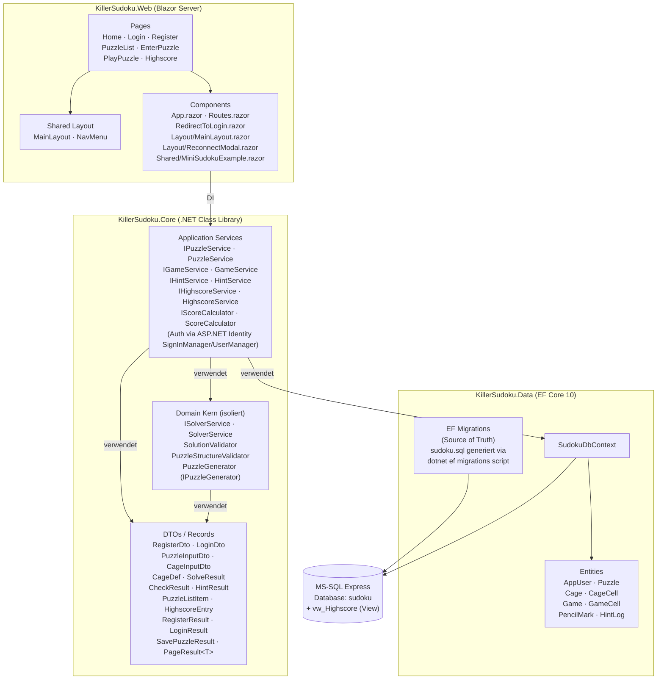

# 5 Bausteinsicht

> arc42 v8.2 · Kapitel 5 · Killer Sudoku
> Bezug: [Kapitel 4](04-solution-strategy.md) · [`../functionality.md`](../functionality.md) (autoritativ für Service-Signaturen) · [`../erm.md`](../erm.md) · [`../../db/sudoku.sql`](../../db/sudoku.sql)

Dieses Kapitel zerlegt das System statisch in seine Bausteine. Die Service-Signaturen werden **nicht** dupliziert — sie stehen in [`../functionality.md`](../functionality.md) §Service-Interfaces. Hier wird die Architektur-Sicht beschrieben: Zweck, Schnittstellen, enthaltene Klassen, Abhängigkeiten.

---

## 5.1 Whitebox Gesamtsystem

Die Gesamtanwendung besteht aus drei Projekten/Assemblies (vorgesehene Aufteilung in der .NET-Solution):

**Projekt-Verantwortlichkeiten kurz:**

- `KillerSudoku.Web` — UI-Schicht; rein präsentational; keine Geschäftslogik; ruft Services per DI auf.
- `KillerSudoku.Core` — Application Services + isolierter Domain-Kern (Solver/Validator) + DTOs; **keine** EF-Core-Abhängigkeit im Domain-Kern.
- `KillerSudoku.Data` — Persistenz; EF-Core-DbContext, Entity-Mappings, Migrations. Wird von Application-Services verwendet, aber nicht von der UI direkt.

---

## 5.2 Baustein-Tabellen (Whitebox je Layer)

Für jeden Baustein: Zweck · Schnittstellen (eingehend/ausgehend) · enthaltene Klassen/Komponenten. Service-Signaturen siehe [Funktionalitäts-Matrix](../functionality.md).

### 5.2.1 KillerSudoku.Web — Presentation Layer

| Aspekt | Details |
|--------|---------|
| **Zweck** | Blazor-Server-Anwendung; rendert UI, leitet User-Aktionen an Application-Services weiter, zeigt Ergebnisse. |
| **Eingehende Schnittstelle** | HTTP-Requests vom Browser (Routes aus [Funktionalitäts-Matrix](../functionality.md) §Screen-Inventar S1–S8); SignalR-Verbindung für interaktive Updates. |
| **Ausgehende Schnittstelle** | Application-Services via DI: `IPuzzleService`, `IGameService`, `IHintService`, `IHighscoreService`. Auth direkt über ASP.NET-Identity-`SignInManager<AppUser>` und `UserManager<AppUser>` (kein eigener Wrapper-Service). |
| **Pages (`@page`)** | `Home.razor` (S1, `/`) · `Auth/Register.razor` (S2, `/register`) · `Auth/Login.razor` (S3, `/login`) · `Puzzles.razor` (S4, `/puzzles`) · `EnterPuzzle.razor` (S5, `/puzzles/new`) · `PlayPuzzle.razor` (S6, `/puzzles/{id}/play`) · `Highscore.razor` (S7, `/highscore`). |
| **Shared Components** | `App.razor` · `Routes.razor` · `RedirectToLogin.razor` · `MainLayout.razor` · `ReconnectModal.razor` · `MiniSudokuExample.razor` · `Error.razor` · `NotFound.razor`. |
| **Querschnitt** | `[Authorize]` auf allen Pages außer S1/S2/S3 ([V16](../validation.md#v16--authorization-alle-geschützten-seitenendpoints)); `EditForm` mit Antiforgery ([V15](../validation.md#v15--csrf-alle-post-endpoints)); Razor-`@`-Encoding ([V14](../validation.md#v14--xss--output-encoding-alle-screens)). |
| **Test-Strategie** | bUnit-Component-Tests (Rendering, Event-Handler), E2E ohne Framework gemäß README §3.2. |

**Inline-UI:** Die im class-diagram.md skizzierten Sub-Komponenten (`PuzzleGrid`, `Toolbar`, `CageEditor`, `HintButton`, `PauseButton`, `CheckSolutionButton`, `PencilMarkLayer`, `FilterBar`, `PuzzleCard`, `HighscoreTable`, `RegisterForm`, `LoginForm`, `RulesPanel`, `NavMenu`) sind aktuell **nicht als eigene .razor-Dateien implementiert** — ihre Markup-/Event-Handler-Logik lebt inline in den Pages (`PlayPuzzle.razor`, `EnterPuzzle.razor`, `Puzzles.razor`, `Highscore.razor`, `Home.razor`, `Auth/Login.razor`, `Auth/Register.razor`). Dies hält den Component-Tree flach. Eine spätere Extraktion ist möglich, ohne API-Brüche.

### 5.2.2 KillerSudoku.Core — Application Services

| Aspekt | Details |
|--------|---------|
| **Zweck** | Use-Case-Orchestrierung; konvertiert UI-Eingaben in DB-Operationen + Domain-Aufrufe; setzt Transaktions- und Autorisierungs-Grenzen. |
| **Eingehende Schnittstelle** | Service-Interfaces `IPuzzleService`, `IGameService`, `IHintService`, `IHighscoreService` — komplette Signaturen [siehe Funktionalitäts-Matrix](../functionality.md). Auth-Flows (UC02/UC03) verwenden direkt ASP.NET-Identity (`SignInManager<AppUser>`, `UserManager<AppUser>`) ohne eigene Wrapper-Service-Schicht. |
| **Ausgehende Schnittstelle** | `ISolverService` (Domain) + `SudokuDbContext` (Data). |
| **Enthaltene Services** | `PuzzleService` (UC04/UC05/UC12) · `GameService` (UC06/UC09/UC10/UC13/UC14) · `HintService` (UC07) · `HighscoreService` (UC08) · **`ScoreCalculator`** (Singleton, pure Funktion — wird von `GameService.CompleteGameAsync` aufgerufen). UC02/UC03 (Register/Login) werden direkt über ASP.NET-Identity-Services (`SignInManager`, `UserManager`) in den Razor-Pages umgesetzt. |
| **UC-Mapping** | Vollständig in [Funktionalitäts-Matrix](../functionality.md) §Matrix-Tabelle. |
| **Test-Strategie** | Unit-Tests pro Service mit gemocktem `ISolverService` + `SudokuDbContext` (EF InMemory); Integration-Tests gegen echte MS-SQL-Test-DB. |

**HighscoreService — View-Status:** Der Service liest aktuell mit LINQ-Joins über `Games ⋈ AppUser ⋈ Puzzle`. Die View `vw_Highscore` existiert zwar im SQL-Schema (`db/sudoku.sql`), wird aber vom `SudokuDbContext` **nicht** als Keyless-Entity gemappt. Switch ist offen — Schema-Reserve.

### 5.2.3 KillerSudoku.Core — Domain-Kern (Solver/Validator)

| Aspekt | Details |
|--------|---------|
| **Zweck** | Reine Algorithmik für die vier Killer-Sudoku-Regeln aus README §1: (1) "Each row, column, and nonet contains each number exactly once", (2) "The sum of all numbers in a cage must match the small number printed in its corner", (3) "No number appears more than once in a cage", (4) "The solution must be unique". |
| **Eingehende Schnittstelle** | `ISolverService` — Methoden `Solve(givenValues, cages)` und `CountSolutions(givenValues, cages)` ([Funktionalitäts-Matrix](../functionality.md) §Service-Interfaces). |
| **Ausgehende Schnittstelle** | **Keine** — pure C# ohne Framework- oder DB-Abhängigkeit. |
| **Enthaltene Klassen** | `SolverService` (Backtracking + MRV + Bit-Masken + Cage-Pruning, sealed) · `SolutionValidator` (Vollständigkeit → Σ=405 → Row/Col/Nonet → Cage-Sum/Duplikat für UC09) · `PuzzleStructureValidator` (Pre-Save-Check: Difficulty, Cage-Sum-Range, Coverage 81 Zellen für UC04) · `PuzzleGenerator` (Random-Generator für UC04 Editor) · `ScoreCalculator` (Score-Formel UC08/UC10). **Die Hint-Strategien (Naked Single → Cage-Forced → Solver-Fallback) sind in `HintService` (Data-Layer) inline implementiert**, nicht als eigenständige Domain-Klasse. |
| **Performance-Anforderung** | AC11.2: terminiert auch bei schweren Puzzles in < 2 s; bricht bei Zähl-Modus nach der 2. gefundenen Lösung ab. |
| **Test-Strategie** | Reine Unit-Tests mit den 2 README-Beispielen (§1.2) + Edge-Cases: unsolvable, multi-solution, vollständig vor-gelöst, minimal-clue. Höchste Test-Coverage-Priorität (siehe [Funktionalitäts-Matrix](../functionality.md) §Kritische Abhängigkeiten). |

### 5.2.4 KillerSudoku.Data — Persistence Layer

| Aspekt | Details |
|--------|---------|
| **Zweck** | EF-Core-Persistenz; Mapping C#-Entities ↔ T-SQL-Tabellen aus [`../../db/sudoku.sql`](../../db/sudoku.sql); Query-Optimierung; View-Zugriff. |
| **Eingehende Schnittstelle** | `SudokuDbContext` (DbSet&lt;T&gt; für jede Entity). |
| **Ausgehende Schnittstelle** | T-SQL gegen MS-SQL Express via ADO.NET-Provider. |
| **Enthaltene Entities** | `AppUser` · `Puzzle` · `Cage` · `CageCell` · `Game` · `GameCell` · `PencilMark` · `HintLog`. Schema-Quelle: [`../../db/sudoku.sql`](../../db/sudoku.sql), ERD: [`../erm.md`](../erm.md). |
| **View-Read-Model** | `vw_Highscore` existiert im SQL-Schema (`db/sudoku.sql` Z. 215–231), wird vom aktuellen `SudokuDbContext` aber **nicht** als Keyless-Entity gemappt. `HighscoreService` liest stattdessen via LINQ-Join über `_db.Games` (siehe §5.2.2). |
| **DB-Constraints (Defense-Layer)** | Siehe §5.4 unten. |
| **Test-Strategie** | Integration-Tests mit Testcontainers (MS-SQL-Image) oder lokaler Test-DB; Constraint-Tests (INSERT mit Difficulty=4 muss fehlschlagen) gemäß [`../erm.md`](../erm.md) §Ableitungen für Tests. |

---

## 5.3 ER-Modell (Verweis + Einbettung)

Das vollständige ER-Modell mit Identity-Spalten und Nullable-Markierungen ist autoritativ in [`../erm.md`](../erm.md). Für die PDF-Lesbarkeit wird hier nur eine konzeptionelle Übersicht referenziert — die fachlichen Beziehungen lauten:

- `AppUser` (Identity-Basisklasse) 1:N `Puzzle` (CreatedBy)
- `AppUser` 1:N `Game`
- `Puzzle` 1:N `Cage` (1..*)
- `Cage` 1:N `CageCell` (jede Zelle 0–8 × 0–8 pro Puzzle eindeutig — durch Trigger erzwungen)
- `Game` 1:N `GameCell`, `PencilMark`, `HintLog`

**Schlüssel-Begründungen (Auszug aus [`../erm.md`](../erm.md)):**

- `AppUser` statt `User` — `USER` ist reserviertes T-SQL-Keyword.
- `RowIdx`/`ColIdx` statt `Row`/`Col` — beides reserviert.
- **Keine Solution-Spalte** in `Puzzle` — UC04 wörtlich: *"No solution is recorded. Solutions must be calculated with an algorithm"*.
- `vw_Highscore`-VIEW existiert im SQL-Schema als Reserve; `HighscoreService` liest aktuell via LINQ-Join (single source of truth: `Game`-Tabelle).
- Pause-Mechanik via `IsPaused` + `PausedAt` + `TotalPausedSeconds` → erlaubt sauberen Resume mit `TimeSeconds = DATEDIFF(SECOND, StartTime, EndTime) − TotalPausedSeconds`.

---

## 5.4 SQL-Schema-Übersicht

Vollständiges Schema in [`../../db/sudoku.sql`](../../db/sudoku.sql). Folgende Objekte werden angelegt:

**Tabellen (in Reverse-FK-Reihenfolge erzeugt):**

- `AppUser` — Benutzer mit gehashtem Passwort
  - ASP.NET Identity-Basis: nutzt UserName, NormalizedUserName, Email, NormalizedEmail, PasswordHash, SecurityStamp, ConcurrencyStamp, Lockout-Felder, AccessFailedCount.
  - Filtered UNIQUE: `IX_AppUser_UserName` und `IX_AppUser_Email` (jeweils WHERE NOT NULL).
  - **Keine** CHECK-Constraints für UserName-Non-Empty oder Email-Format im Schema — Validation läuft Client + Server (siehe [`../validation.md`](../validation.md) V01/V02).
  - Zusätzliche Spalte `CreatedAt` (datetime2(0)).
- `Puzzle` — Killer-Sudoku-Definition, **keine** Solution-Spalte
  - FK: `CreatedById → AppUser(Id)`
  - CHECK: `Difficulty BETWEEN 1 AND 3`
- `Cage` — Cage-Gruppe mit Soll-Summe
  - FK: `PuzzleId → Puzzle(Id)` ON DELETE CASCADE
  - CHECK: `Sum BETWEEN 1 AND 45`
  - Index: `IX_Cage_PuzzleId`
- `CageCell` — Zelle in einem Cage (Composite PK)
  - PK: `(CageId, RowIdx, ColIdx)`
  - FK: `CageId → Cage(Id)` ON DELETE CASCADE
  - CHECK: `RowIdx`, `ColIdx` BETWEEN 0 AND 8
- `Game` — Spiel-Session
  - FK: `UserId → AppUser(Id)`, `PuzzleId → Puzzle(Id)`
  - CHECK: `TimeSeconds` NULL oder ≥ 0, `Score` NULL oder ≥ 0, `HintsUsed ≥ 0`, `TotalPausedSeconds ≥ 0`
  - Indices: `IX_Game_UserId`, `IX_Game_PuzzleId`
- `GameCell` — Aktueller Spielzustand pro Zelle
  - PK: `(GameId, RowIdx, ColIdx)`
  - FK: `GameId → Game(Id)` ON DELETE CASCADE
  - CHECK: `CellValue IS NULL OR BETWEEN 1 AND 9`
- `PencilMark` — Kandidaten-Annotationen (UC14)
  - PK: `(GameId, RowIdx, ColIdx, MarkValue)`
  - FK: `GameId → Game(Id)` ON DELETE CASCADE
  - CHECK: `MarkValue BETWEEN 1 AND 9`
- `HintLog` — Audit-Log für Hint-Nutzung (UC07)
  - FK: `GameId → Game(Id)` ON DELETE CASCADE
  - Index: `IX_HintLog_GameId`

**Index/Constraint-Spezialitäten:**

- **Trigger `trg_CageCell_UniquePerPuzzle`** — verhindert, dass eine Zelle in mehreren Cages desselben Puzzles liegt. Wirft `THROW 50001` bei Verletzung (siehe `sudoku.sql` Zeilen 100–121).
- **Filtered Unique Index `UX_Game_ActiveOnly`** — `(UserId, PuzzleId)` WHERE `IsCompleted = 0`; setzt AC13.3 durch ("max 1 aktives Game pro User-Puzzle-Kombi").

**View:**

- `vw_Highscore` — JOIN über `Game ⋈ AppUser ⋈ Puzzle` für `IsCompleted = 1 AND Score IS NOT NULL`. Liefert `GameId · UserId · Username · PuzzleId · Difficulty · TimeSeconds · HintsUsed · Score · CompletedAt`. Wird von `IHighscoreService.GetTopAsync(limit)` für UC08 verwendet.

---

> **Nächstes Kapitel:** [Kapitel 6 — Laufzeitsicht](06-runtime-view.md) — Sequenz-Diagramme der vier wichtigsten Szenarien (Puzzle-Save, Hint, Check-Solution, Pause/Resume).
