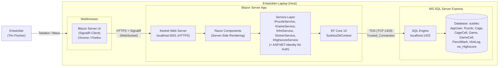
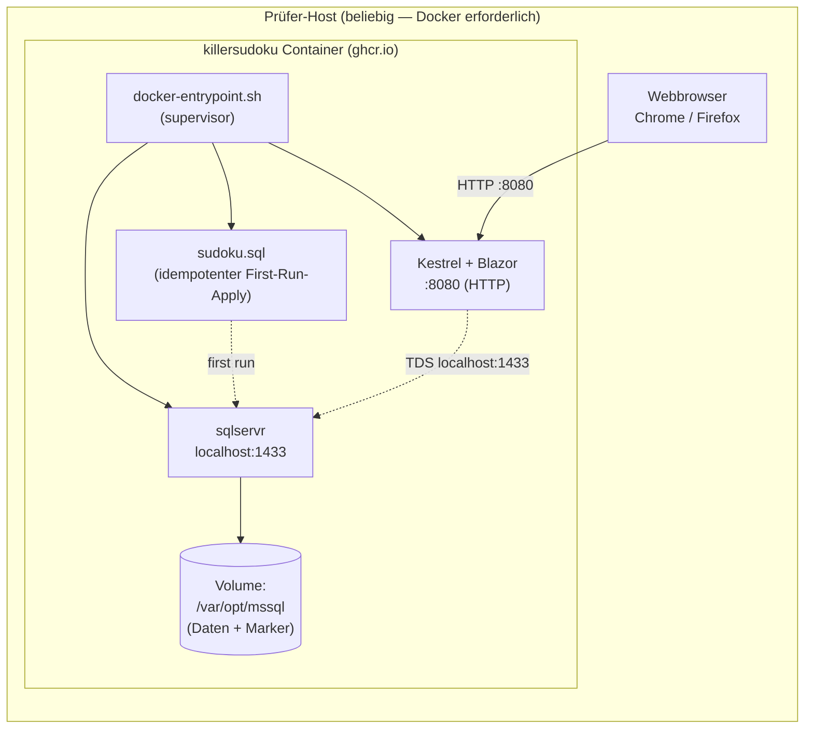
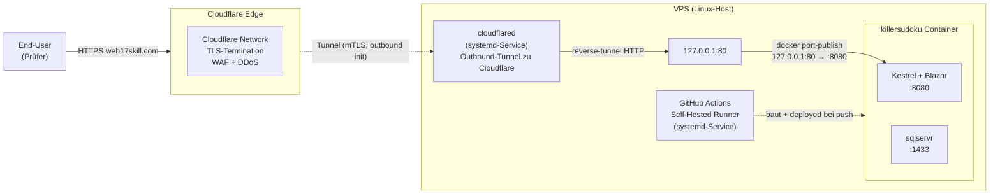

# 7 Verteilungssicht

> arc42 v8.2 · Skills Battle 2026 — Application Development — Killer Sudoku
> Quelldokument (autoritativ): [`skillsbattle2026_1.1.md`](../../skillsbattle2026_1.1.md)

Dieses Kapitel beschreibt die physische Verteilung der Anwendung. Da die Aufgabenstellung explizit ein lokales Setup vorsieht (README §1.3: "create a database named 'sudoku' on MySQL or MS-SQL server **running on your machine**"), ist die Verteilungssicht bewusst einfach gehalten: Alle Komponenten laufen auf demselben Entwickler-Laptop.

---

## §7.1 Deployment-Diagramm

Die folgende Verteilungssicht zeigt die Laufzeit-Knoten der Anwendung beim Wettbewerbs-Setup. Alle drei Komponenten (Browser, Blazor-Server-App, DB-Server) laufen auf demselben Host (Entwickler-Laptop).



### Knoten-Inventar

| Knoten | Typ | Adresse / Port | Technologie | Quelle |
|--------|-----|----------------|-------------|--------|
| Entwickler-Laptop | Hardware-Host | localhost | macOS / Windows | README §1.3 ("on your machine") |
| Webbrowser | Client-Runtime | — | Chrome oder Firefox (modern HTML5) | Mockup-Briefs (Web-UI) |
| Blazor Server App | Anwendungs-Server | `localhost:5001` (HTTPS) | .NET 10, Kestrel, Blazor Server (SignalR) | [erm.md](../erm.md), [functionality.md](../functionality.md) |
| MS-SQL Server Express | DB-Server | `localhost:1433` | MS-SQL Express, Datenbank `sudoku` | README §1.3 ("MS-SQL server"), [`sudoku.sql`](../../db/sudoku.sql) |

### Kommunikationspfade

| Von | Zu | Protokoll | Bemerkung |
|-----|----|-----------|-----------|
| Browser | Blazor Server App | HTTPS + WebSocket (SignalR) | Blazor Server hält permanente SignalR-Verbindung pro Tab/Circuit (siehe [functionality.md](../functionality.md#stack-konventionen)) |
| Blazor Server App | MS-SQL Express | TDS (TCP 1433) | EF Core via `SqlConnection`, Trusted_Connection (Windows-Auth) bzw. lokaler Service-Account |

### Bemerkungen

- Es gibt **keine** Cloud-Komponenten, kein CDN, keine externen APIs — die Aufgabenstellung sieht ein rein lokales Setup vor.
- Die SignalR-Verbindung ist Folge des Blazor-Server-Modells (siehe [ADR-001](./09-decisions.md#adr-001--stack-net-10--blazor-server--ms-sql-server)).
- Single-Host-Setup bedeutet: kein Reverse-Proxy, keine Lastverteilung, keine separate Auth-Komponente.

---

## §7.2 Infrastruktur-Anforderungen (lokal)

### Software-Voraussetzungen

| Komponente | Version | Zweck | Quelle |
|------------|---------|-------|--------|
| .NET SDK | 10.x | Build & Run der Blazor-Server-App | Stack-Definition [erm.md](../erm.md), [functionality.md](../functionality.md) |
| MS-SQL Server Express | aktuelle Version | Datenbank-Engine für `sudoku`-DB | README §1.3 ("MS-SQL server") |
| SQL Server Management Studio (SSMS) | beliebig | Ausführen von `sudoku.sql` (Schema-Setup), Tabellen-Inspektion | Operative Empfehlung |
| Visual Studio 2026 oder Visual Studio Code | beliebig | Entwicklungs-IDE | Empfehlung Entwickler-Werkzeug |
| Webbrowser | Chrome oder Firefox (modern) | Frontend-Runtime | Standard Blazor-Server-Anforderung |

### Hardware-Voraussetzungen

Da Blazor Server serverseitig rendert und der Solver eine reine In-Memory-Operation ist, sind die Hardware-Anforderungen moderat:

- Standard-Entwickler-Laptop (8 GB RAM, x64-CPU) ausreichend
- Disk: < 1 GB für SDK + Express + Source-Code + DB-Files

### Konfiguration / Ports

| Port | Dienst | Bemerkung |
|------|--------|-----------|
| `5001` | Kestrel HTTPS (Blazor Server) | Default-Port .NET-Web-Templates |
| `1433` | MS-SQL Server Express | Default-Port SQL-Server |

### Datenbank-Setup

Die Datenbank-Erstellung erfolgt einmalig via SSMS oder `sqlcmd`:

```bash
# Beispiel mit sqlcmd (Windows / macOS-Crossplattform)
sqlcmd -S "(local)\SQLEXPRESS" -E -i db/sudoku.sql
```

Das Skript [`db/sudoku.sql`](../../db/sudoku.sql) ist **idempotent**: Es prüft auf `DB_ID('sudoku')` und droppt bestehende Objekte in Reverse-FK-Reihenfolge, bevor neu angelegt wird. Damit ist ein wiederholtes Ausführen ohne Konflikte möglich.

---

## §7.3 Build & Run

### Build

```bash
# Restore + Build
dotnet restore
dotnet build -c Release
```

### Run (Entwicklung)

```bash
dotnet run --project source/src/KillerSudoku.Web
```

Die App ist anschliessend unter `https://localhost:5001` erreichbar.

### Connection-String

```
Server=(local)\SQLEXPRESS;Database=sudoku;Trusted_Connection=True;TrustServerCertificate=True;
```

Der Connection-String wird via `appsettings.json` / `appsettings.Development.json` oder Umgebungsvariable konfiguriert. Trusted Connection (Windows-Auth) ist auf dem Wettbewerbs-Laptop ausreichend; Cross-Plattform-Setups (macOS) verwenden Username/Password über `User Id=... ;Password=...`.

> **Sicherheit:** Auch im lokalen Setup wird der Connection-String nicht in den Source-Code hardkodiert (siehe [Kapitel 8 §8.4 Logging](./08-cross-cutting.md#84-logging) und [V03](../validation.md#v03--passwort-uc02-uc03)). `TrustServerCertificate=True` ist akzeptabel, da kein Netzwerk-Hop über das lokale Setup hinaus stattfindet.

### Tests ausführen

```bash
dotnet test
```

Test-Frameworks gemäss [ADR-011](./09-decisions.md#adr-011--test-pyramide-xunit--bunit--webapplicationfactory--playwright-net):

- Unit-Tests (xUnit) — Solver-Logik, Service-Methoden, Validation
- Component-Tests (bUnit) — Razor-Components ([siehe functionality.md](../functionality.md))
- Integration-Tests (xUnit + `WebApplicationFactory`) — DB + Auth + Service-End-to-End
- E2E-Tests (Playwright .NET) — Kritische User-Flows (UC01, UC03, UC06, UC09)

---

## §7.4 Submission-Artefakte

### ZIP-Inhalt (gemäss README §1.4)

README §1.4 fordert wörtlich:
> "All deliverables must be submitted in a zip file named `AppDev_Name_FirstName.zip`. The deliverables are the documentation including the test protocol, executable files, the source code and the database script."

Daraus leitet sich folgende Submission-Struktur ab:

```
AppDev_Fischer_Tim.zip
├── doc/
│   ├── arc42.pdf                (Kapitel 01–12 als ein PDF)
│   ├── mockups/                 (PNG-Exports aus Figma)
│   └── test-protocol.pdf
├── source/                              (.NET 10 Solution)
│   ├── KillerSudoku.slnx
│   ├── src/
│   │   ├── KillerSudoku.Web/            (Blazor Server App)
│   │   ├── KillerSudoku.Core/           (Solver, Domain, Services, DTOs)
│   │   └── KillerSudoku.Data/           (EF Core, Entities, DbContext, Service-Impl)
│   └── tests/
│       ├── KillerSudoku.UnitTests/      (xUnit)
│       ├── KillerSudoku.IntegrationTests/ (xUnit + Testcontainers-MSSQL)
│       ├── KillerSudoku.ComponentTests/ (bUnit)
│       └── KillerSudoku.E2ETests/       (Playwright .NET)
├── bin/
│   └── Release/net10.0/         (Build-Output, ausführbare Files)
└── db/
    └── sudoku.sql               (DB-Script)
```

### Build-Output (Executables)

Das README fordert "executable files". Für .NET 10 + Blazor Server bedeutet dies:

```bash
dotnet publish source/src/KillerSudoku.Web -c Release -o bin/Release/net10.0
```

Der Publish-Output enthält:

- `KillerSudoku.Web.dll` (Haupt-Assembly)
- `KillerSudoku.Web.exe` (Windows-Launcher, falls auf Windows publiziert)
- Alle Dependency-DLLs
- `appsettings.json` (mit Connection-String-Slot)
- `wwwroot/` (statische Assets, CSS, JS)

Starten der publizierten App:

```bash
cd bin/Release/net10.0
dotnet KillerSudoku.Web.dll
```

### Datenbank-Script

`db/sudoku.sql` (siehe [`sudoku.sql`](../../db/sudoku.sql)) ist im ZIP enthalten und entspricht README §1.3:
> "Create for each table a SQL statement and save them in a script called `sudoku.sql`. Don't forget to create the primary and foreign key constraints."

Das Skript erstellt:

- Datenbank `sudoku` (idempotent)
- Tabellen `AppUser`, `Puzzle`, `Cage`, `CageCell`, `Game`, `GameCell`, `PencilMark`, `HintLog`
- PK/FK/CHECK/UNIQUE-Constraints
- Trigger `trg_CageCell_UniquePerPuzzle` (siehe [ADR-004](./09-decisions.md#adr-004--cell-uniqueness-per-puzzle-via-trigger))
- View `vw_Highscore` (siehe [ADR-003](./09-decisions.md#adr-003--highscore-als-view-statt-tabelle))

### Dokumentation

README §2.6 fordert wörtlich folgende Dokumentations-Sektionen:

| README-Anforderung | Abgedeckt in |
|--------------------|--------------|
| "Mockup" | [`mockup-briefs.md`](../mockup-briefs.md) + [`mockups/`](../mockups/) |
| "Database diagram" | [`erm.md`](../erm.md) (Mermaid ERD) + Kapitel 5 Bausteinsicht |
| "Class diagram" | Kapitel 5 Bausteinsicht — Service-Interfaces aus [`functionality.md`](../functionality.md) |
| "Additionally chosen use cases" | [`use-cases.md`](../use-cases.md) UC12–UC14 + [ADR-014](./09-decisions.md#adr-014--auswahl-der-3-zusätzlichen-use-cases) |
| "Validation rules" | [`validation.md`](../validation.md) (V01–V16) |
| "Test protocol" | [`test-protocol.md`](../test-protocol.md) + [`test-protocol.csv`](../test-protocol.csv) |

README §2.6 weiter: "For the delivery, create a PDF document." Die arc42-Kapitel werden zu einem PDF zusammengeführt (Submission-Format).

### Termin-Constraints

README §1.4: "Note that the submission of the planned test cases must take place **by 12 o'clock**." Der Test-Plan ist in [`test-protocol.md`](../test-protocol.md) dokumentiert und wird vor 12:00:00 abgegeben (siehe Qualitätsziel Q3 in [Kapitel 1 §1.2](./01-introduction.md#12-qualitätsziele)).

---

## §7.5 Container-Deployment (Single-Image Docker)

Zusätzlich zur nativen Variante (§7.1–§7.3) wird ein **containerisiertes Single-Image-Deployment** ausgeliefert. Es enthält Webserver, App und Datenbank in einem Image — der Prüfer kann mit einem einzigen `docker run` die gesamte Anwendung starten, ohne MS-SQL Server lokal installieren zu müssen.

Siehe [ADR-015](./09-decisions.md#adr-015--single-image-container-für-prüferbequemlichkeit) für die Begründung der Single-Image-Wahl (statt klassischem Multi-Service-Compose).

### Deployment-Diagramm (Container)



### Image-Inhalt

| Layer | Quelle | Zweck |
|-------|--------|-------|
| Base | `mcr.microsoft.com/mssql/server:2022-latest` (Ubuntu 22.04) | DB-Engine + EULA-Akzeptanz |
| `aspnetcore-runtime-10.0` | `packages.microsoft.com` | .NET 10 ASP.NET Runtime für Blazor Server |
| `mssql-tools18` | MS-Repo | `sqlcmd` für Schema-Apply beim ersten Start |
| `/app/` | Multi-Stage Build (Stage 1) | `dotnet publish` Output des Web-Projekts |
| `/docker-init/sudoku.sql` | Repo `db/sudoku.sql` | Schema-Script (DDL + Trigger + View) |
| `/docker-entrypoint.sh` | Repo-Root | Startup-Orchestrierung |

### Startup-Sequenz

`docker-entrypoint.sh` führt beim Container-Start folgende Schritte aus (atomar, vollständige Konvergenz):

1. `sqlservr` als Background-Prozess starten
2. Bis zu 60× `sqlcmd -Q "SELECT 1"`-Ping (≤ 2 Min) — wartet auf DB-Readiness
3. Falls Marker-File `/var/opt/mssql/.killersudoku-schema-applied` **nicht** existiert: `sudoku.sql` ausführen und Marker setzen
4. `dotnet KillerSudoku.Web.dll` als zweiter Hintergrund-Prozess starten
5. `wait -n` blockiert bis SQL oder App terminiert → dann sauberer SIGTERM an beide Children

### Build & Run

#### Option A — Pull vom Registry (schnellster Pfad für Prüfer)

```bash
docker pull ghcr.io/tim-fischer-zh/killer-sudoku:latest
docker run -d \
  --name killersudoku \
  -p 8080:8080 \
  -e MSSQL_SA_PASSWORD='Sudoku!Strong#Pass#2026' \
  -v killersudoku-data:/var/opt/mssql \
  ghcr.io/tim-fischer-zh/killer-sudoku:latest

# Browser → http://localhost:8080
```

#### Option B — Lokal aus Sources bauen

```bash
# Repo-Root als Build-Context (enthält source/ + db/ + docker-entrypoint.sh)
docker build -t killersudoku:local .
docker run -d -p 8080:8080 \
  -e MSSQL_SA_PASSWORD='Sudoku!Strong#Pass#2026' \
  killersudoku:local
```

#### Option C — `docker compose` (empfohlen)

```bash
docker compose up --build
```

Compose-Datei: [`docker-compose.yml`](../../docker-compose.yml) — bindet Port 8080 (App) und 1433 (DB, optional für externe SSMS-Inspektion), persistiert SQL-Daten in einem Named Volume.

### Ports

| Port | Zweck | Default-Mapping |
|------|-------|-----------------|
| `8080` | Kestrel HTTP (Blazor Server) | `-p 8080:8080` |
| `1433` | MS-SQL (intern + optional extern für SSMS) | `-p 1433:1433` (kann weggelassen werden) |

> **Hinweis:** Im Container läuft Kestrel auf HTTP (`:8080`), nicht HTTPS. Ein TLS-Terminator (z.B. Traefik/Caddy) ist nicht im Image enthalten — für die Submission-Bewertung ist Localhost-HTTP ausreichend. Die Auth-Cookies bleiben `HttpOnly + SameSite=Lax` (siehe [V03](../validation.md#v03--passwort-uc02-uc03)) — der `Secure`-Flag ist im Container-Lauf nur unter HTTPS-Reverse-Proxy zu setzen.

### Environment-Variablen

| Variable | Default | Zweck |
|----------|---------|-------|
| `MSSQL_SA_PASSWORD` | `Sudoku!Strong#Pass#2026` | SA-Passwort (Strong-Password-Policy von MS-SQL muss erfüllt sein) |
| `MSSQL_PID` | `Express` | Edition (Free-Tier für Submission) |
| `ACCEPT_EULA` | `Y` | MS-SQL Lizenz-Akzeptanz (Pflicht) |
| `ASPNETCORE_URLS` | `http://+:8080` | Kestrel-Binding |
| `ConnectionStrings__Sudoku` | siehe Dockerfile | Override möglich für Tests |

### Persistenz

Die DB-Files (`mdf` / `ldf`) liegen in `/var/opt/mssql` im Container. Ein Named-Volume `killersudoku-data` (oder ein Bind-Mount) erhält den Spielstand zwischen Container-Neustarts. Das Marker-File `/var/opt/mssql/.killersudoku-schema-applied` verhindert mehrfaches Schema-Apply.

### CI / Registry-Push

Die GitHub-Actions-Pipeline [`.github/workflows/deploy.yml`](../../.github/workflows/deploy.yml) baut bei jedem `push` auf `main` das Image und pusht es nach `ghcr.io/tim-fischer-zh/killer-sudoku` mit Tags:

- `:latest` (auf default-Branch)
- `:<git-short-sha>` (immutable per Commit)

Im Anschluss führt derselbe Workflow das Production-Deployment auf der VPS aus (siehe §7.6).

### Submission-Inhalt (Update zu §7.4)

Zusätzlich zum ZIP-Inhalt aus §7.4 enthält das Repository (und damit `src/` im ZIP):

- `Dockerfile` (Repo-Root)
- `docker-entrypoint.sh` (Repo-Root)
- `docker-compose.yml` (Repo-Root, lokal)
- `docker-compose.prod.yml` (Repo-Root, Production — siehe §7.6)
- `.dockerignore` (Repo-Root)
- `.github/workflows/deploy.yml`

Der Prüfer kann damit zwischen den drei Optionen (Pull / Local-Build / Compose) wählen.

---

## §7.6 Production-Deployment (Bonus: Live-Demo unter web17skill.com)

Über das von der Aufgabenstellung geforderte lokale Setup (§7.1–§7.5) hinaus wird die Anwendung **zusätzlich** auf einer öffentlich erreichbaren VPS-Instanz betrieben, damit der Prüfer einen Live-Stand der App ohne lokale Installation aufrufen kann. Die Produktions-Topologie ist **kein** Ersatz für das lokale Setup — sie ergänzt es.

### Live-Endpoint

| Item | Wert |
|------|------|
| Domain | `web17skill.com` |
| Protokoll | HTTPS (TLS-Termination bei Cloudflare) |
| TLS-Zertifikat | Cloudflare-managed (automatisch) |
| Health-Endpoint | `https://web17skill.com/health` |

### Topologie



### Knoten-Inventar (Production)

| Knoten | Typ | Adresse | Quelle |
|--------|-----|---------|--------|
| Cloudflare Edge | Managed CDN/Proxy | `web17skill.com` | externer Dienst |
| VPS | Linux-Host (Docker, systemd) | privat, nicht-öffentlich erreichbar | Tim Fischer Setup |
| `cloudflared` | systemd-Service | bindet `127.0.0.1:80` als Tunnel-Origin | Cloudflare-Dokumentation |
| GitHub Actions Self-Hosted Runner | systemd-Service | derselbe VPS-Host wie Cloudflared | GitHub-Dokumentation |
| killersudoku-Container | Docker-Container | `127.0.0.1:80 → 8080` | `docker-compose.prod.yml` |

### Kommunikationspfade (Production)

| Von | Zu | Protokoll | Bemerkung |
|-----|----|-----------|-----------|
| End-User-Browser | Cloudflare | HTTPS (TLS 1.3) | Cloudflare-WAF und DDoS-Mitigation aktiv |
| Cloudflare | `cloudflared` auf VPS | mTLS-Tunnel (outbound initiiert) | Kein eingehender Port auf der VPS offen — Tunnel terminiert HTTPS bei Cloudflare und forwarded plain HTTP an `127.0.0.1:80` |
| `cloudflared` | Container | HTTP `127.0.0.1:80` | Docker-Port-Publish bindet bewusst nur auf Loopback — Container ist **nicht** von außen direkt erreichbar |
| Container-intern | sqlservr | TDS `localhost:1433` | DB-Port **nicht** publiziert — interner Zugriff nur über Loopback im Container |

### Warum Cloudflare-Tunnel statt offener Port?

| Aspekt | Tunnel (gewählt) | Klassischer Reverse-Proxy mit offenem Port |
|--------|------------------|--------------------------------------------|
| Eingehende Firewall-Regeln auf VPS | keine nötig | Port 80/443 müssen offen sein |
| TLS-Zertifikat | Cloudflare-managed (auto-renew) | selbst-verwaltet (Let's Encrypt o.ä.) |
| DDoS-Schutz | inkludiert | nicht inkludiert |
| IP-Adresse der VPS sichtbar | nein | ja |

Der Tunnel ist **outbound initiiert** — die VPS hält die Verbindung zu Cloudflare offen, nicht umgekehrt. Das bedeutet, dass auf der VPS **keine eingehenden Ports** in der Firewall geöffnet werden müssen.

### `docker-compose.prod.yml` — Production-Unterschiede

Die Production-Compose ([`docker-compose.prod.yml`](../../docker-compose.prod.yml)) unterscheidet sich an drei Stellen von der lokalen Compose (siehe §7.5):

| Aspekt | Lokal (`docker-compose.yml`) | Production (`docker-compose.prod.yml`) |
|--------|------------------------------|----------------------------------------|
| App-Port-Bind | `8080:8080` (alle Interfaces) | `127.0.0.1:80:8080` (nur Loopback, weil `cloudflared` lokal terminiert) |
| SQL-Port-Bind | `127.0.0.1:1433:1433` (lokale SSMS-Inspektion) | nicht publiziert (keine externe DB-Inspektion in Produktion) |
| Image-Quelle | lokaler `build:` Context | gezogen aus GHCR (`pull_policy` nicht gesetzt — Runner baut lokal und compose nutzt das Image direkt aus dem lokalen Daemon) |

### CI-Pipeline (`.github/workflows/deploy.yml`)

Der Workflow läuft auf `runs-on: self-hosted` — also direkt auf der VPS. Vier Schritte:

1. **Checkout** des Repos auf der VPS
2. **`docker build`** — lokal auf der VPS (Layer-Cache bleibt zwischen Runs erhalten)
3. **Push** der Image-Tags `:latest` und `:<short-sha>` nach GHCR (für Versionierung und ggf. spätere Rollbacks)
4. **`docker compose -f docker-compose.prod.yml up -d --remove-orphans`** — startet/ersetzt den Container; das Image liegt nach `docker build` bereits im lokalen Daemon, kein erneuter Pull nötig

Abschließend führt der Workflow einen **Smoke-Test** durch (`curl https://web17skill.com/health` mit Retry über 120 s) und schlägt fehl, falls der Live-Endpoint nicht innerhalb von 2 Minuten gesund antwortet.

### Required Secrets im GitHub-Repository

| Secret | Zweck |
|--------|-------|
| `GHCR_TOKEN` | Classic-PAT mit Scopes `write:packages` + `read:packages` für GHCR-Push |
| `MSSQL_SA_PASSWORD` | SA-Passwort des Production-SQL-Servers (Strong-Password-Policy) |

Beide werden im Workflow als Job-Env-Variablen exponiert und vom Container über `.env` bzw. das DI-Setup konsumiert.

### Trennung Lokal ↔ Production

| Eigenschaft | Lokal (Spec §1.3) | Production (Bonus) |
|-------------|--------------------|--------------------|
| Pflicht laut Aufgabenstellung | ja | nein |
| Adresse | `localhost:5001` (native) bzw. `localhost:8080` (Compose) | `https://web17skill.com` |
| TLS | self-signed Dev-Cert | Cloudflare-managed (echtes Zertifikat) |
| Persistenz | Named Volume oder lokaler SQL-Server | Named Volume `mssql-data` auf VPS |
| Deploy-Mechanismus | manueller `dotnet run` / `docker compose up` | Push auf `main` → automatischer CI-Build + Deploy |

Beide Setups verwenden **dasselbe Image** und **dasselbe Schema** — Production ist nur ein anderer Lauf-Modus, kein architektonischer Unterschied. Die Bewertung der Submission stützt sich ausschließlich auf das lokale Setup; die Live-Variante dient als Bonus für eine bequemere Demonstration.

---

## Verweise

- [Kapitel 2 — Randbedingungen](./02-constraints.md)
- [Kapitel 5 — Bausteinsicht](./05-building-blocks.md)
- [Kapitel 8 — Querschnittliche Konzepte](./08-cross-cutting.md)
- [Kapitel 9 — Architekturentscheidungen](./09-decisions.md)
- [`functionality.md`](../functionality.md) — Service-Layer-Inventar
- [`sudoku.sql`](../../db/sudoku.sql) — DB-Schema
- [`skillsbattle2026_1.1.md`](../../skillsbattle2026_1.1.md) — Aufgabenstellung
