# 10 Qualitätsanforderungen

> arc42 v8.2 · Skills Battle 2026 — Application Development — Killer Sudoku
> Quelldokument (autoritativ): [`skillsbattle2026_1.1.md`](../../skillsbattle2026_1.1.md)

Dieses Kapitel präzisiert die in [§1.2](./01-introduction.md#12-qualitätsziele) genannten Top-Ziele in Form eines Quality-Trees und konkreter, testbarer Quality-Szenarien.

---

## §10.1 Quality-Tree

Der Tree gliedert das übergeordnete Ziel "Qualität" in fünf Attribute. Jedes Blatt ist über ein Szenario in [§10.2](#102-quality-szenarien) operationalisiert.

```mermaid
graph TD
    Q[Qualität]

    Q --> KO[Korrektheit]
    KO --> KO1[Solver liefert 0/1/≥2 Solutions korrekt]
    KO --> KO2[Validation V09 + V10 vollständig]
    KO --> KO3[Auth: Hash + Cookie Flags]

    Q --> PE[Performance]
    PE --> PE1[Solver-Lauf < 2 s]
    PE --> PE2[Page-Load < 1 s]
    PE --> PE3[Highscore-Query < 500 ms]

    Q --> SI[Sicherheit]
    SI --> SI1[Generische Login-Fehlermeldung]
    SI --> SI2[CSRF Antiforgery aktiv]
    SI --> SI3[Passwort-Hash PBKDF2 / BCrypt]
    SI --> SI4[Cookie HttpOnly + Secure + SameSite=Lax]

    Q --> WA[Wartbarkeit]
    WA --> WA1[Test-Coverage ≥ 80%]
    WA --> WA2[ADRs dokumentiert]
    WA --> WA3[Layered Architecture]

    Q --> US[Usability]
    US --> US1[Tastatur-Shortcuts]
    US --> US2[Verständliche Fehlermeldungen]
    US --> US3[Mockup-Konsistenz S1–S7]
```

**Zuordnung Top-Ziele → Quality-Tree-Knoten:**

| Top-Ziel (siehe §1.2) | Tree-Knoten |
|------------------------|-------------|
| Q1 Korrektheit des Solvers | KO1, KO2, PE1 |
| Q2 Lösungs-Eindeutigkeit | KO1 (Branch `Solutions ≥ 2`), siehe [V07](../validation.md#v07--puzzle-solvability-uc05) |
| Q3 Test-Abdeckung | WA1 |

---

## §10.2 Quality-Szenarien

Jedes Szenario ist tabellarisch nach dem arc42-Schema **Quelle · Stimulus · Artefakt · Reaktion · Antwortmaß** beschrieben. Spalte "Test-Anker" verlinkt die geplanten Unit-/Integration-/E2E-Tests (siehe [`test-protocol.md`](../test-protocol.md)).

### Q01 — Solver-Korrektheit (Eindeutigkeit)

| Feld | Wert |
|------|------|
| Quelle | Wettbewerbs-Prüfer / interner Integration-Test |
| Stimulus | Solver bekommt ein Puzzle mit genau einer Lösung übergeben |
| Artefakt | `ISolverService.Solve(givenValues, cages)` |
| Reaktion | Solver gibt `SolveResult { Solutions = 1, Solution = …}` zurück; bei mehrdeutigem Puzzle stoppt er bei 2 Lösungen und liefert `Solutions = 2` |
| Antwortmaß | **100%** der Test-Cases (beide README-Beispiele + Edge-Cases unlösbar / mehrdeutig) liefern korrekten Solutions-Count |
| README-Beleg | §1 "The solution **must be unique**." + §2.1 UC11 "Solutions **must be calculated with an algorithm**." |
| Test-Anker | UC11 → AC11.1 (siehe [use-cases.md UC11](../use-cases.md#uc11--auto-solve)) |

### Q02 — Solver-Performance

| Feld | Wert |
|------|------|
| Quelle | Wettbewerbs-Prüfer (Demo-Lauf) |
| Stimulus | Solver wird mit schwerem Puzzle (Difficulty 3) aufgerufen |
| Artefakt | `ISolverService.Solve` (Backtracking + Constraint-Propagation) |
| Reaktion | Solver terminiert und liefert Ergebnis |
| Antwortmaß | **≤ 2 Sekunden** auf lokaler Test-Maschine |
| README-Beleg | implizit aus UC05 ("solvability check vor Speichern") und UC07 ("ask for a hint") — bei längerer Laufzeit ist UX nicht akzeptabel |
| Test-Anker | UC11 → AC11.2 |

### Q03 — Login-Security (kein Username-Leak)

| Feld | Wert |
|------|------|
| Quelle | Externer Angreifer / Security-Reviewer |
| Stimulus | Login-POST mit unbekanntem Username oder falschem Passwort |
| Artefakt | `Login.razor` mit `SignInManager<AppUser>.PasswordSignInAsync` |
| Reaktion | Server antwortet mit **generischer** Fehlermeldung "Username oder Passwort falsch." — **keine** Unterscheidung zwischen "User existiert nicht" und "Passwort falsch" |
| Antwortmaß | Response-Body, Statuscode und Antwortzeit identisch für beide Fälle (kein Timing-Leak via getrennten Code-Pfaden) |
| README-Beleg | §2.1 UC2 "a login **is required**." in Kombination mit Sicherheits-Best-Practices ([V03](../validation.md#v03--passwort-uc02-uc03)) |
| Test-Anker | UC03 → AC03.1 |

### Q04 — Page-Load (Play-Screen)

| Feld | Wert |
|------|------|
| Quelle | End-Nutzer |
| Stimulus | Klick auf Puzzle in Liste S4 → Navigation zu Screen S6 (`/puzzles/{id}/play`) |
| Artefakt | Blazor-Server-Page `PlayPuzzle.razor` + initiale SignalR-Verbindung + DB-Query Cages |
| Reaktion | Grid + Cages + Toolbar werden vollständig gerendert |
| Antwortmaß | **< 1 Sekunde** bei MS-SQL Server lokal (Loopback) und Cold-Cache |
| README-Beleg | impliziert durch §1.1 "appropriate navigation" + "controls for all functions" |
| Test-Anker | Manueller UI-Test im [`test-protocol.md`](../test-protocol.md) |

### Q05 — Auth-Cookie-Sicherheit

| Feld | Wert |
|------|------|
| Quelle | Security-Reviewer / Browser DevTools |
| Stimulus | Erfolgreicher Login (UC03) |
| Artefakt | ASP.NET Core Authentication Cookie |
| Reaktion | Cookie wird mit Flags **HttpOnly + Secure + SameSite=Lax** ausgestellt |
| Antwortmaß | Set-Cookie-Header enthält alle drei Attribute (binary check: pass/fail) |
| README-Beleg | §2.1 UC2 "login is required" + Sicherheits-Defaults nach [V15](../validation.md#v15--csrf-alle-post-endpoints) |
| Test-Anker | UC03 → AC03.3 |

### Q06 — Test-Coverage

| Feld | Wert |
|------|------|
| Quelle | Wettbewerbs-Prüfer (Submission-Bewertung) |
| Stimulus | Build + Test-Lauf via `dotnet test` |
| Artefakt | xUnit Test-Suite + Coverlet Coverage-Report |
| Reaktion | Report zeigt Coverage-Wert pro Projekt |
| Antwortmaß | **≥ 80%** Line- + Branch-Coverage über Solver / Service-Layer |
| README-Beleg | §3.1 "For each use case, create at least one positive, one negative, and, where possible, one test case for boundary conditions." + §3.2 "Running the test cases **should be implemented with a test framework**." |
| Test-Anker | Coverlet-Report als Submission-Artefakt; siehe Top-Ziel **Q3** in [§1.2](./01-introduction.md#12-qualitätsziele) |

---

## §10.3 Querverweise

- [Top-Ziele §1.2](./01-introduction.md#12-qualitätsziele) — drei priorisierte Ziele
- [Validation V01–V16](../validation.md) — Detailregeln pro Layer (Client / Server / DB)
- [Use Cases UC01–UC14](../use-cases.md) — Acceptance Criteria (AC) je UC
- [Test-Protokoll](../test-protocol.md) — konkrete Test-Cases mit Erwartung
- [Kapitel 11 — Risiken](./11-risks.md) — Risiken, die die Qualitätsziele bedrohen
