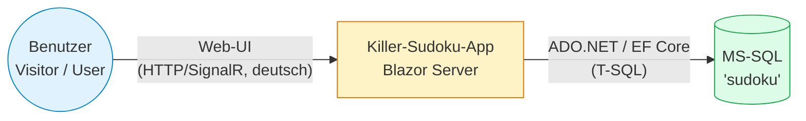
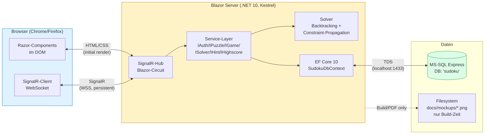
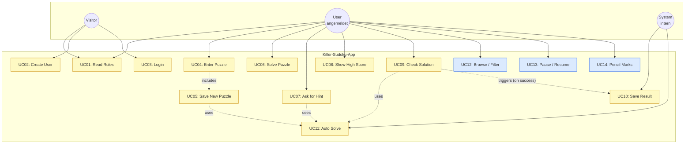

<h1 id="chapter-3">3 Kontextabgrenzung</h1>

> arc42 v8.2 · Killer Sudoku App
> Quelle (autoritativ): **Aufgabenstellung**

Die Kontextabgrenzung beschreibt die Systemgrenze: **welche Akteure** mit der Anwendung interagieren, **welche Nachbarsysteme** angesprochen werden, und über **welche Schnittstellen** die Kommunikation läuft. Sie unterscheidet fachlich (welche Akteure / welche Use Cases) und technisch (welche Protokolle / Komponenten).

---

## §3.1 Fachlicher Kontext

### System-Grenze

Die Killer-Sudoku-App ist primär ein **lokal betriebenes System** mit einer Web-UI (Spec-konform laut README §1.3). Es existieren **keine externen Fachsysteme** (kein Drittanbieter-Login, keine externen APIs, keine Bezahl-/Mailservices).

> **Zusätzlich:** Eine **Bonus-Production-Instanz** der App ist unter `https://web17skill.com` erreichbar (siehe [§7.6 Production-Deployment](#chapter-7) und [ADR-016](#chapter-9)). Diese Variante ist **nicht** Pflicht laut Aufgabenstellung und ändert weder den fachlichen Kontext noch die Systemgrenze — sie ist nur eine andere Betriebsumgebung desselben Images.

### Akteure

| Akteur | Beschreibung | Berührungspunkte (UC) |
|--------|--------------|------------------------|
| **Visitor** | Nicht angemeldeter Browser-Nutzer. Darf nur die öffentlichen Seiten sehen. | **UC01** (Rules), **UC02** (Register), **UC03** (Login) |
| **User** | Angemeldeter Spieler. Darf Puzzles erstellen, spielen, Highscore sehen. | **UC04**–**UC10**, **UC12**–**UC14** |
| **System** (intern, kein externer Akteur) | Triggert automatische Folge-UCs (z.B. UC10 nach erfolgreichem UC09). | **UC10**, **UC11** (intern aufgerufen von UC05/UC07/UC09) |

### Keine externen Akteure / Nachbar-Systeme

Folgendes ist **bewusst nicht** Teil des Kontexts (siehe [Kapitel 2](#chapter-2)):

- Kein Identity-Provider (Google/Microsoft/Apple-SSO)
- Kein Email-Service (kein Email-Verifikations- oder Password-Reset-Flow im Scope)
- Keine externen Highscore-/Leaderboard-APIs
- Kein Cloud-Backend — Anwendung läuft lokal mit lokaler DB

> README §1.3 (wörtlich): "create a database named 'sudoku' on MySQL or MS-SQL server **running on your machine**." → klare Lokal-Vorgabe.

### Eingaben / Ausgaben über die System-Grenze

| Richtung | Daten | Kanal |
|----------|-------|-------|
| User → App | Login-Credentials, Puzzle-Definition (Cages + Summen), Zelleneingaben (1–9), Hint-/Check-/Pause-Aktionen | HTTP-POST (initial) + SignalR-WebSocket (Blazor-Server-Circuit) |
| App → User | Gerendertes 9×9-Grid, Cage-Borders + Summen, Timer, Hint-Ergebnis, Lösungs-Validierungs-Status, Highscore-Liste, Fehlermeldungen (deutsch) | HTML/CSS (initial) + SignalR-Patches (UI-Updates) |
| App → DB | INSERT/UPDATE/SELECT auf `AppUser`, `Puzzle`, `Cage`, `CageCell`, `Game`, `GameCell`, `PencilMark`, `HintLog` (siehe **ER-Modell**) | EF Core über ADO.NET / TDS-Protokoll |
| DB → App | Abfrage-Resultate, generierte Primary Keys, View-Daten (`vw_Highscore`) | TDS |

---

## §3.2 Technischer Kontext

### Komponenten & Protokolle

### Schnittstellen-Details

| Schnittstelle | Protokoll | Format | Notiz |
|---------------|-----------|--------|-------|
| Browser ↔ Server (Initial-Page-Load) | HTTPS | HTML | Erste Request liefert Razor-gerendertes HTML inkl. Blazor-Bootstrapper. |
| Browser ↔ Server (UI-Interaktion) | SignalR über WebSocket (WSS) | binär (MessagePack) | Persistente Verbindung pro Blazor-Circuit. UI-State serverseitig. |
| Server ↔ DB | TDS via `Microsoft.Data.SqlClient` | T-SQL | Local-Loopback (`localhost:1433` oder Named Pipe). |
| Server ↔ Filesystem | nur Build-Zeit | PNG (Mockups), PDF (Doku) | Keine Runtime-File-IO ausser Logs. |

### Blazor-Server-Circuit (zentrales technisches Konzept)

- **State serverseitig:** Game-State, aktuelle Zell-Auswahl, Pencil-Marks-Status leben in C#-Components auf dem Server.
- **UI-Updates push-basiert:** Server pusht Diff-Patches an den Client über SignalR.
- **Skalierung:** Eine Circuit pro Browser-Tab. Bei Disconnect → State kann via Reconnect wiederhergestellt werden (Standard-Blazor-Mechanismus; siehe auch **UC13** für explizite Pause/Resume-Semantik).

### Lokales Setup (Single-Machine-Deployment)

Aus README §1.3 ("running on your machine") folgt: Die App und die DB laufen **auf dem gleichen Host**. Es gibt keinen Multi-Tier-Deployment-Plan. Details siehe spätere Kapitel:

- [Kapitel 5 — Bausteinsicht](#chapter-5) (TBD): innere Struktur Service-Layer
- [Kapitel 7 — Verteilungssicht](#chapter-7) (TBD): lokales Deployment-Diagramm

---

## §3.3 Use-Case-Übersicht

Vollständige UC-Spezifikation: siehe **Use-Cases-Dokument**. Diese Sektion liefert nur die Aktor-Sicht und das Diagramm als Kontext-Anker.

### Use-Case-Diagramm

**Legende:** Gelb = README §2.1 (UC01–UC11) · Blau = selbst gewählte Zusatz-UCs §2.3 (UC12–UC14).

### Kurz-Mapping (Detail in **Use-Cases-Dokument**)

| UC | Kurzbeschreibung | Akteur | Auth |
|----|------------------|--------|------|
| **UC01** | Regeln + Beispiel auf Startseite | Visitor / User | public |
| **UC02** | Account erstellen | Visitor | public |
| **UC03** | Anmelden | Visitor | public |
| **UC04** | Puzzle manuell anlegen (Cages + Summen, Difficulty 1–3) | User | required |
| **UC05** | Puzzle speichern — nur wenn solvable + eindeutig | User | required |
| **UC06** | Puzzle spielen | User | required |
| **UC07** | Hint anfordern | User | required |
| **UC08** | Highscore-Liste | User | required |
| **UC09** | Lösung prüfen (Sum-Check 405 → Vollvalidierung) | User | required |
| **UC10** | Game-Resultat speichern (Time, Hints, Score) | System | required |
| **UC11** | Solver (intern für UC05/UC07/UC09) | System | n/a |
| **UC12** | Puzzle-Liste mit Filter/Sort | User | required |
| **UC13** | Spiel pausieren und fortsetzen | User | required |
| **UC14** | Candidate-Notes pro Zelle | User | required |

### Use-Case-Cluster (zur Test-Planung)

| Cluster | UCs | Test-Fokus |
|---------|-----|------------|
| **Authentifizierung** | UC02, UC03 | Sicherheit (**V01**–**V04**, **V16**) |
| **Puzzle-Lifecycle** | UC04, UC05, UC11 | Solver-Korrektheit (Q1), Eindeutigkeit (Q2) |
| **Spiel-Flow** | UC06, UC07, UC09, UC10, UC13, UC14 | Game-State-Konsistenz (**V12**) |
| **Diskover & Stats** | UC01, UC08, UC12 | Read-Pfade, Sortierung/Pagination |

---

## Verweise

- [Kapitel 1 — Einführung und Ziele](#chapter-1)
- [Kapitel 2 — Randbedingungen](#chapter-2)
- Use Cases UC01–UC14 (Detail)
- Validation Rules
- **Funktionalitäts-Matrix**
- **ER-Modell**
- **Mockup-Briefings**
