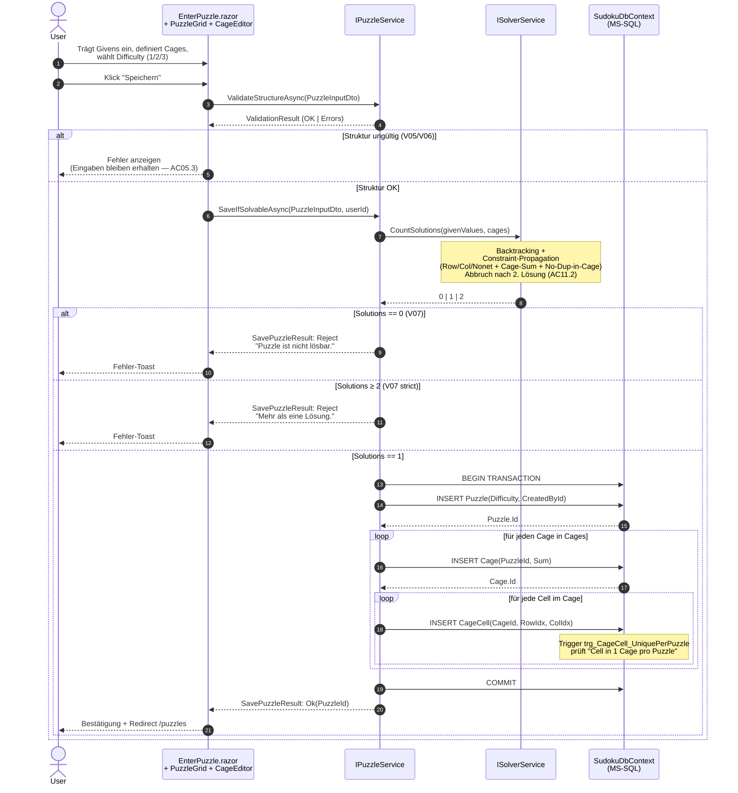
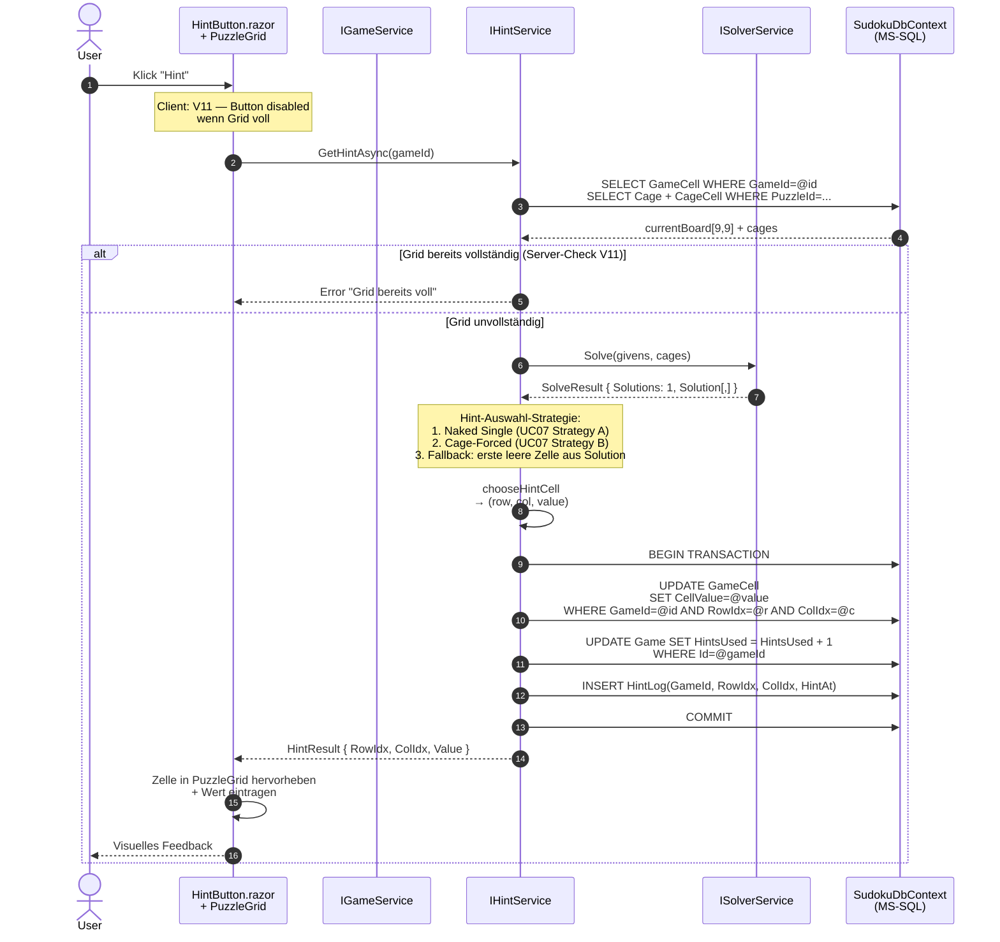
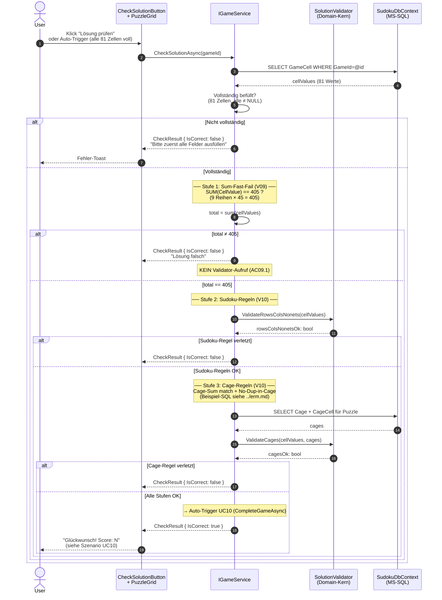
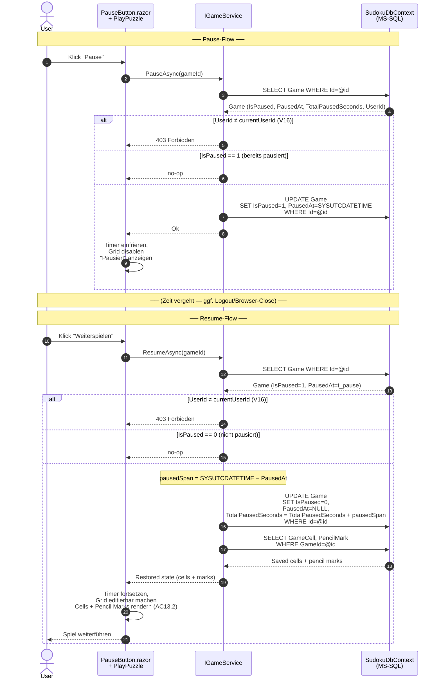

<h1 id="chapter-6">6 Laufzeitsicht</h1>

> arc42 v8.2 · Kapitel 6 · Killer Sudoku
> Bezug: [Kapitel 5](#chapter-5) · **Use-Cases-Dokument** · **Funktionalitäts-Matrix** · **Validation-Regeln** · **ER-Modell**

Dieses Kapitel beschreibt die wichtigsten **Laufzeit-Szenarien** als Sequenz-Diagramme. Service-Methoden-Namen entsprechen exakt dem Service-Interface-Block in **Funktionalitäts-Matrix** §Service-Interfaces. DB-Tabellen sind in **Datenbank-Skript** belegt.

**Auswahl der Szenarien:** Die vier dargestellten Use-Case-Flows decken die kritischen Architektur-Pfade ab — Save-with-Solver, Hint-Generation, Solution-Check (inkl. Sum-Fast-Fail) und Pause/Resume-State-Persistierung. Diese Pfade involvieren alle drei Layer + den Domain-Kern.

---

## 6.1 Szenario A — Puzzle anlegen und speichern (UC04 + UC05)

**Ziel:** User erstellt ein neues Killer-Sudoku, Server validiert Struktur, ruft Solver für Eindeutigkeits-Check, persistiert nur bei genau einer Lösung. Wörtliche README-Grundlage: *"The puzzle can only be saved if it is solvable"* (UC05) und *"The solution must be unique"* (§1).

**Beteiligt:** UC04 + UC05 · **V05** · **V06** · **V07** · Screen S5.

**Wichtige Architektur-Eigenschaften:**

- **Transaktionsklammer** liegt in `IPuzzleService.SaveIfSolvableAsync`, nicht in der UI.
- **Solver wird VOR jedem INSERT** ausgeführt — keine "Roll-Back-on-Failure"-Konstruktion nötig.
- **Keine Solution-Speicherung** — UC04 wörtlich: *"No solution is recorded"*; die Cage-Tabelle reicht für späteres Re-Solving.
- **DB-Trigger** ist Last-Line-of-Defense — falls die Application-Validierung Bugs hat, schützt der Trigger Datenintegrität (Defense-in-Depth).

---

## 6.2 Szenario B — Hint anfordern (UC07)

**Ziel:** User klickt "Hint", System bestimmt aus aktuellem Spielzustand eine Zelle + den korrekten Wert, persistiert Hint-Audit-Eintrag, inkrementiert `HintsUsed` (Score-relevant via UC08).

**Beteiligt:** UC07 · **V11** · Screen S6 · `IHintService` + `ISolverService`.

**Wichtige Architektur-Eigenschaften:**

- **Solver wird stateless aufgerufen** — er bekommt den aktuellen Board-Zustand inkl. User-Eingaben; durch AC11.1 (Solver erkennt 0/1/≥2 korrekt) ist garantiert, dass das gespeicherte Puzzle eine eindeutige Lösung hat, also `Solutions == 1` für vorherige Hint-Anfragen sicher ist (solange User-Eingaben nicht widersprüchlich sind — siehe UC07 AC07.3).
- **HintsUsed** wird atomar mit dem `GameCell`-Update und dem `HintLog`-INSERT in einer Transaktion erhöht — Audit + Score-Input bleiben konsistent.
- **Score-Wirkung:** Jeder Hint kostet 300 Punkte (Formel UC08 §High Score) — daher die Audit-Disziplin.

---

## 6.3 Szenario C — Lösung prüfen (UC09)

**Ziel:** User triggert Lösungsprüfung; System validiert in **drei Stufen**, sortiert nach Performance: (1) Sum-Check 405 als O(1)-Fast-Fail, (2) Row/Col/Nonet-Check, (3) Cage-Sum + Cage-No-Duplicate. README §2.3 wörtlich: *"Use the value for a 'simple' validation before checking the solution with an algorithm"*.

**Beteiligt:** UC09 · **V09** · **V10** · Screen S6 · `IGameService`.

**Performance-Begründung (in Reihenfolge der drei Stufen):**

1. **Sum-Check 405** — O(81) Addition, kein Allokation. Filtert grobe Fehler (falsche Zahl, vergessene Zelle) sofort.
2. **Row/Col/Nonet** — 27 × 9-Element-Distinct-Check, O(243) ohne Set-Allokation via Bitmask.
3. **Cage-Sum + No-Duplicate** — Pro Cage einmal `cellValues` durchgehen, Set-basierter Duplikat-Check. Komplexität proportional zur Anzahl Cages × Cage-Größe ≤ 81 Operationen.

Die Sum-Check-Reihenfolge ist nicht Optimierung um der Optimierung willen — sie ist **wörtliche Anforderung** aus README §2.3 und Pattern für **alle** "simple before algorithmic" Validierungen im System.

---

## 6.4 Szenario D — Pause und Resume (UC13)

**Ziel:** User pausiert ein laufendes Spiel; Server friert Timer ein und persistiert den Zustand; bei Resume wird der Timer um die Pausen-Dauer korrigiert weitergeführt. Formel aus **ER-Modell**: `TimeSeconds = DATEDIFF(SECOND, StartTime, EndTime) − TotalPausedSeconds`.

**Beteiligt:** UC13 · **V12** · Screen S6 · `IGameService.PauseAsync`/`ResumeAsync`.

**Wichtige Architektur-Eigenschaften:**

- **TotalPausedSeconds** wird inkrementell aufaddiert — mehrere Pause/Resume-Zyklen sind dadurch sauber unterstützt.
- **Timer-Berechnung** bleibt in der DB-Formel verankert (siehe Comment-Block in **Datenbank-Skript** Zeilen 125–127): bei Spiel-Abschluss (UC10) gilt `TimeSeconds = DATEDIFF(SECOND, StartTime, EndTime) − TotalPausedSeconds`.
- **Filtered Unique Index** `UX_Game_ActiveOnly` (**ER-Modell**) garantiert AC13.3: ein User kann pro Puzzle nur **ein** nicht abgeschlossenes Game haben — verhindert Pause-im-Spiel-1 + Neu-Start-Spiel-2-vor-Resume-Doubles.
- **Auto-Save bei jedem Move** (UC13 Alt-Flow "Browser-Tab schliessen ohne Pause"): `IGameService.SetCellValueAsync` persistiert jeden Zell-Change sofort — daher ist auch ein impliziter "Pause durch Wegnavigation" verlustfrei.
- **Authorization** (**V16**): jede Mutation prüft `Game.UserId == currentUserId` und antwortet mit 403 bei Mismatch.

---

> **Nächstes Kapitel:** [Kapitel 7 — Verteilungssicht](#chapter-7) (TBD) — Deployment-Diagramm: lokale Dev-Workstation, MS-SQL-Express-Instanz, Build-/Run-Konfiguration.
