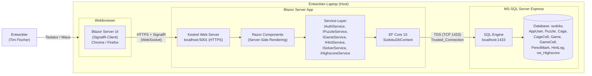
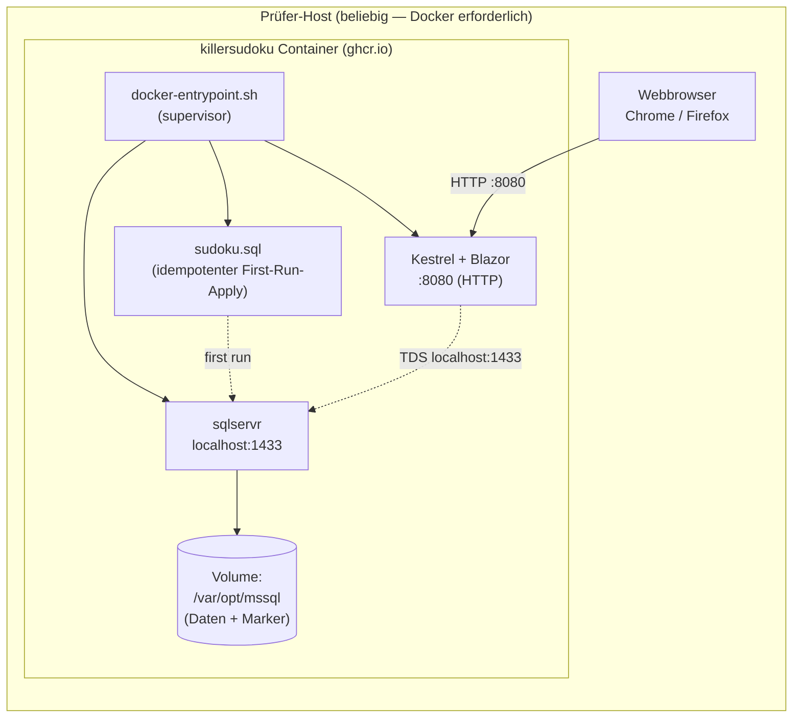

<h1 id="chapter-7">7 Verteilungssicht</h1>

> arc42 v8.2 · Skills Battle 2026 — Application Development — Killer Sudoku
> Quelldokument (autoritativ): **Aufgabenstellung**

Dieses Kapitel beschreibt die physische Verteilung der Anwendung. Da die Aufgabenstellung explizit ein lokales Setup vorsieht (README §1.3: "create a database named 'sudoku' on MySQL or MS-SQL server **running on your machine**"), ist die Verteilungssicht bewusst einfach gehalten: Alle Komponenten laufen auf demselben Entwickler-Laptop.

---

## §7.1 Deployment-Diagramm

Die folgende Verteilungssicht zeigt die Laufzeit-Knoten der Anwendung beim Wettbewerbs-Setup. Alle drei Komponenten (Browser, Blazor-Server-App, DB-Server) laufen auf demselben Host (Entwickler-Laptop).



### Knoten-Inventar

| Knoten | Typ | Adresse / Port | Technologie | Quelle |
|--------|-----|----------------|-------------|--------|
| Entwickler-Laptop | Hardware-Host | localhost | macOS / Windows | README §1.3 ("on your machine") |
| Webbrowser | Client-Runtime | — | Chrome oder Firefox (modern HTML5) | Mockup-Briefs (Web-UI) |
| Blazor Server App | Anwendungs-Server | `localhost:5001` (HTTPS) | .NET 10, Kestrel, Blazor Server (SignalR) | **ER-Modell**, **Funktionalitäts-Matrix** |
| MS-SQL Server Express | DB-Server | `localhost:1433` | MS-SQL Express, Datenbank `sudoku` | README §1.3 ("MS-SQL server"), **Datenbank-Skript** |

### Kommunikationspfade

| Von | Zu | Protokoll | Bemerkung |
|-----|----|-----------|-----------|
| Browser | Blazor Server App | HTTPS + WebSocket (SignalR) | Blazor Server hält permanente SignalR-Verbindung pro Tab/Circuit (siehe **Funktionalitäts-Matrix**) |
| Blazor Server App | MS-SQL Express | TDS (TCP 1433) | EF Core via `SqlConnection`, Trusted_Connection (Windows-Auth) bzw. lokaler Service-Account |

### Bemerkungen

- Es gibt **keine** Cloud-Komponenten, kein CDN, keine externen APIs — die Aufgabenstellung sieht ein rein lokales Setup vor.
- Die SignalR-Verbindung ist Folge des Blazor-Server-Modells (siehe [ADR-001](#chapter-9)).
- Single-Host-Setup bedeutet: kein Reverse-Proxy, keine Lastverteilung, keine separate Auth-Komponente.

---

## §7.2 Infrastruktur-Anforderungen (lokal)

### Software-Voraussetzungen

| Komponente | Version | Zweck | Quelle |
|------------|---------|-------|--------|
| .NET SDK | 10.x | Build & Run der Blazor-Server-App | Stack-Definition **ER-Modell**, **Funktionalitäts-Matrix** |
| MS-SQL Server Express | aktuelle Version | Datenbank-Engine für `sudoku`-DB | README §1.3 ("MS-SQL server") |
| SQL Server Management Studio (SSMS) | beliebig | Ausführen von **Datenbank-Skript** (Schema-Setup), Tabellen-Inspektion | Operative Empfehlung |
| Visual Studio 2026 oder Visual Studio Code | beliebig | Entwicklungs-IDE | Empfehlung Entwickler-Werkzeug |
| Webbrowser | Chrome oder Firefox (modern) | Frontend-Runtime | Standard Blazor-Server-Anforderung |

### Hardware-Voraussetzungen

Da Blazor Server serverseitig rendert und der Solver eine reine In-Memory-Operation ist, sind die Hardware-Anforderungen moderat:

- Standard-Entwickler-Laptop (8 GB RAM, x64-CPU) ausreichend
- Disk: < 1 GB für SDK + Express + Source-Code + DB-Files

### Konfiguration / Ports

| Port | Dienst | Bemerkung |
|------|--------|-----------|
| `5001` | Kestrel HTTPS (Blazor Server) | Default-Port .NET-Web-Templates |
| `1433` | MS-SQL Server Express | Default-Port SQL-Server |

### Datenbank-Setup

Die Datenbank-Erstellung erfolgt einmalig via SSMS oder `sqlcmd`:

```bash
# Beispiel mit sqlcmd (Windows / macOS-Crossplattform)
sqlcmd -S "(local)\SQLEXPRESS" -E -i db/sudoku.sql
```

Das Skript **Datenbank-Skript** ist **idempotent**: Es prüft auf `DB_ID('sudoku')` und droppt bestehende Objekte in Reverse-FK-Reihenfolge, bevor neu angelegt wird. Damit ist ein wiederholtes Ausführen ohne Konflikte möglich.

---

## §7.3 Build & Run

### Build

```bash
# Restore + Build
dotnet restore
dotnet build -c Release
```

### Run (Entwicklung)

```bash
dotnet run --project src/Sudoku.Web
```

Die App ist anschliessend unter `https://localhost:5001` erreichbar.

### Connection-String

```
Server=(local)\SQLEXPRESS;Database=sudoku;Trusted_Connection=True;TrustServerCertificate=True;
```

Der Connection-String wird via `appsettings.json` / `appsettings.Development.json` oder Umgebungsvariable konfiguriert. Trusted Connection (Windows-Auth) ist auf dem Wettbewerbs-Laptop ausreichend; Cross-Plattform-Setups (macOS) verwenden Username/Password über `User Id=... ;Password=...`.

> **Sicherheit:** Auch im lokalen Setup wird der Connection-String nicht in den Source-Code hardkodiert (siehe [Kapitel 8 §8.4 Logging](#chapter-8) und **V03**). `TrustServerCertificate=True` ist akzeptabel, da kein Netzwerk-Hop über das lokale Setup hinaus stattfindet.

### Tests ausführen

```bash
dotnet test
```

Test-Frameworks gemäss [ADR-011](#chapter-9):

- Unit-Tests (xUnit) — Solver-Logik, Service-Methoden, Validation
- Component-Tests (bUnit) — Razor-Components (**Funktionalitäts-Matrix**)
- Integration-Tests (xUnit + `WebApplicationFactory`) — DB + Auth + Service-End-to-End
- E2E-Tests (Playwright .NET) — Kritische User-Flows (UC01, UC03, UC06, UC09)

---

## §7.4 Submission-Artefakte

### ZIP-Inhalt (gemäss README §1.4)

README §1.4 fordert wörtlich:
> "All deliverables must be submitted in a zip file named `AppDev_Name_FirstName.zip`. The deliverables are the documentation including the test protocol, executable files, the source code and the database script."

Daraus leitet sich folgende Submission-Struktur ab:

```
AppDev_Fischer_Tim.zip
├── doc/
│ ├── arc42.pdf (Kapitel 01–12 als ein PDF)
│ ├── mockups/ (PNG-Exports aus Figma)
│ └── test-protocol.pdf
├── src/ (vollständiger .NET-Source)
│ ├── Sudoku.Web/ (Blazor Server App)
│ ├── Sudoku.Domain/ (Solver, Domain-Modelle)
│ ├── Sudoku.Data/ (EF Core, Repositories)
│ ├── Sudoku.Tests.Unit/
│ ├── Sudoku.Tests.Integration/
│ └── Sudoku.Tests.E2E/
├── bin/
│ └── Release/net10.0/ (Build-Output, ausführbare Files)
└── db/
 └── sudoku.sql (DB-Script)
```

### Build-Output (Executables)

Das README fordert "executable files". Für .NET 10 + Blazor Server bedeutet dies:

```bash
dotnet publish -c Release -o bin/Release/net10.0
```

Der Publish-Output enthält:

- `Sudoku.Web.dll` (Haupt-Assembly)
- `Sudoku.Web.exe` (Windows-Launcher, falls auf Windows publiziert)
- Alle Dependency-DLLs
- `appsettings.json` (mit Connection-String-Slot)
- `wwwroot/` (statische Assets, CSS, JS)

Starten der publizierten App:

```bash
cd bin/Release/net10.0
dotnet Sudoku.Web.dll
```

### Datenbank-Script

`db/sudoku.sql` (siehe **Datenbank-Skript**) ist im ZIP enthalten und entspricht README §1.3:
> "Create for each table a SQL statement and save them in a script called **Datenbank-Skript**. Don't forget to create the primary and foreign key constraints."

Das Skript erstellt:

- Datenbank `sudoku` (idempotent)
- Tabellen `AppUser`, `Puzzle`, `Cage`, `CageCell`, `Game`, `GameCell`, `PencilMark`, `HintLog`
- PK/FK/CHECK/UNIQUE-Constraints
- Trigger `trg_CageCell_UniquePerPuzzle` (siehe [ADR-004](#chapter-9))
- View `vw_Highscore` (siehe [ADR-003](#chapter-9))

### Dokumentation

README §2.6 fordert wörtlich folgende Dokumentations-Sektionen:

| README-Anforderung | Abgedeckt in |
|--------------------|--------------|
| "Mockup" | **Mockup-Briefings** + **Mockup-Verzeichnis** |
| "Database diagram" | **ER-Modell** (Mermaid ERD) + Kapitel 5 Bausteinsicht |
| "Class diagram" | Kapitel 5 Bausteinsicht — Service-Interfaces aus **Funktionalitäts-Matrix** |
| "Additionally chosen use cases" | **Use-Cases-Dokument** UC12–UC14 + [ADR-014](#chapter-9) |
| "Validation rules" | **Validation-Regeln** (V01–V16) |
| "Test protocol" | **Test-Protokoll** + **Test-Protokoll** |

README §2.6 weiter: "For the delivery, create a PDF document." Die arc42-Kapitel werden zu einem PDF zusammengeführt (Submission-Format).

### Termin-Constraints

README §1.4: "Note that the submission of the planned test cases must take place **by 11:30 o'clock**." Der Test-Plan ist in **Test-Protokoll** dokumentiert und wird vor 11:30:00 abgegeben (siehe Qualitätsziel Q3 in [Kapitel 1 §1.2](#chapter-1)).

---

## §7.5 Container-Deployment (Single-Image Docker)

Zusätzlich zur nativen Variante (§7.1–§7.3) wird ein **containerisiertes Single-Image-Deployment** ausgeliefert. Es enthält Webserver, App und Datenbank in einem Image — der Prüfer kann mit einem einzigen `docker run` die gesamte Anwendung starten, ohne MS-SQL Server lokal installieren zu müssen.

Siehe [ADR-015](#chapter-9) für die Begründung der Single-Image-Wahl (statt klassischem Multi-Service-Compose).

### Deployment-Diagramm (Container)



### Image-Inhalt

| Layer | Quelle | Zweck |
|-------|--------|-------|
| Base | `mcr.microsoft.com/mssql/server:2022-latest` (Ubuntu 22.04) | DB-Engine + EULA-Akzeptanz |
| `aspnetcore-runtime-10.0` | `packages.microsoft.com` | .NET 10 ASP.NET Runtime für Blazor Server |
| `mssql-tools18` | MS-Repo | `sqlcmd` für Schema-Apply beim ersten Start |
| `/app/` | Multi-Stage Build (Stage 1) | `dotnet publish` Output des Web-Projekts |
| `/docker-init/sudoku.sql` | Repo `db/sudoku.sql` | Schema-Script (DDL + Trigger + View) |
| `/docker-entrypoint.sh` | Repo-Root | Startup-Orchestrierung |

### Startup-Sequenz

`docker-entrypoint.sh` führt beim Container-Start folgende Schritte aus (atomar, vollständige Konvergenz):

1. `sqlservr` als Background-Prozess starten
2. Bis zu 60× `sqlcmd -Q "SELECT 1"`-Ping (≤ 2 Min) — wartet auf DB-Readiness
3. Falls Marker-File `/var/opt/mssql/.killersudoku-schema-applied` **nicht** existiert: **Datenbank-Skript** ausführen und Marker setzen
4. `dotnet KillerSudoku.Web.dll` als zweiter Hintergrund-Prozess starten
5. `wait -n` blockiert bis SQL oder App terminiert → dann sauberer SIGTERM an beide Children

### Build & Run

#### Option A — Pull vom Registry (schnellster Pfad für Prüfer)

```bash
docker pull ghcr.io/tim-fischer-zh/killer-sudoku:latest
docker run -d \
 --name killersudoku \
 -p 8080:8080 \
 -e MSSQL_SA_PASSWORD='Sudoku!Strong#Pass#2026' \
 -v killersudoku-data:/var/opt/mssql \
 ghcr.io/tim-fischer-zh/killer-sudoku:latest

# Browser → http://localhost:8080
```

#### Option B — Lokal aus Sources bauen

```bash
# Repo-Root als Build-Context (enthält source/ + db/ + docker-entrypoint.sh)
docker build -t killersudoku:local .
docker run -d -p 8080:8080 \
 -e MSSQL_SA_PASSWORD='Sudoku!Strong#Pass#2026' \
 killersudoku:local
```

#### Option C — `docker compose` (empfohlen)

```bash
docker compose up --build
```

Compose-Datei: **docker-compose.yml** — bindet Port 8080 (App) und 1433 (DB, optional für externe SSMS-Inspektion), persistiert SQL-Daten in einem Named Volume.

### Ports

| Port | Zweck | Default-Mapping |
|------|-------|-----------------|
| `8080` | Kestrel HTTP (Blazor Server) | `-p 8080:8080` |
| `1433` | MS-SQL (intern + optional extern für SSMS) | `-p 1433:1433` (kann weggelassen werden) |

> **Hinweis:** Im Container läuft Kestrel auf HTTP (`:8080`), nicht HTTPS. Ein TLS-Terminator (z.B. Traefik/Caddy) ist nicht im Image enthalten — für die Submission-Bewertung ist Localhost-HTTP ausreichend. Die Auth-Cookies bleiben `HttpOnly + SameSite=Lax` (siehe **V03**) — der `Secure`-Flag ist im Container-Lauf nur unter HTTPS-Reverse-Proxy zu setzen.

### Environment-Variablen

| Variable | Default | Zweck |
|----------|---------|-------|
| `MSSQL_SA_PASSWORD` | `Sudoku!Strong#Pass#2026` | SA-Passwort (Strong-Password-Policy von MS-SQL muss erfüllt sein) |
| `MSSQL_PID` | `Express` | Edition (Free-Tier für Submission) |
| `ACCEPT_EULA` | `Y` | MS-SQL Lizenz-Akzeptanz (Pflicht) |
| `ASPNETCORE_URLS` | `http://+:8080` | Kestrel-Binding |
| `ConnectionStrings__Sudoku` | siehe Dockerfile | Override möglich für Tests |

### Persistenz

Die DB-Files (`mdf` / `ldf`) liegen in `/var/opt/mssql` im Container. Ein Named-Volume `killersudoku-data` (oder ein Bind-Mount) erhält den Spielstand zwischen Container-Neustarts. Das Marker-File `/var/opt/mssql/.killersudoku-schema-applied` verhindert mehrfaches Schema-Apply.

### CI / Registry-Push

Die GitHub-Actions-Pipeline **.github/workflows/docker.yml** baut bei jedem `push` auf `main` das Image und pusht es nach `ghcr.io/tim-fischer-zh/killer-sudoku` mit Tags:

- `:latest` (auf default-Branch)
- `:sha-<git-short-sha>` (immutable per Commit)
- `:<branch>` / `:<tag>` bei feature-Branches und Releases

Die Pipeline nutzt GHA-Cache (`type=gha`) für Schichten — der Multi-Stage-`dotnet publish` läuft inkremental und nicht bei jedem Push komplett neu.

### Submission-Inhalt (Update zu §7.4)

Zusätzlich zum ZIP-Inhalt aus §7.4 enthält das Repository (und damit `src/` im ZIP):

- `Dockerfile` (Repo-Root)
- `docker-entrypoint.sh` (Repo-Root)
- `docker-compose.yml` (Repo-Root)
- `.dockerignore` (Repo-Root)
- `.github/workflows/docker.yml`

Der Prüfer kann damit zwischen den drei Optionen (Pull / Local-Build / Compose) wählen.

---

## Verweise

- [Kapitel 2 — Randbedingungen](#chapter-2)
- [Kapitel 5 — Bausteinsicht](#chapter-5)
- [Kapitel 8 — Querschnittliche Konzepte](#chapter-8)
- [Kapitel 9 — Architekturentscheidungen](#chapter-9)
- **Funktionalitäts-Matrix** — Service-Layer-Inventar
- **Datenbank-Skript** — DB-Schema
- **Aufgabenstellung** — Aufgabenstellung
