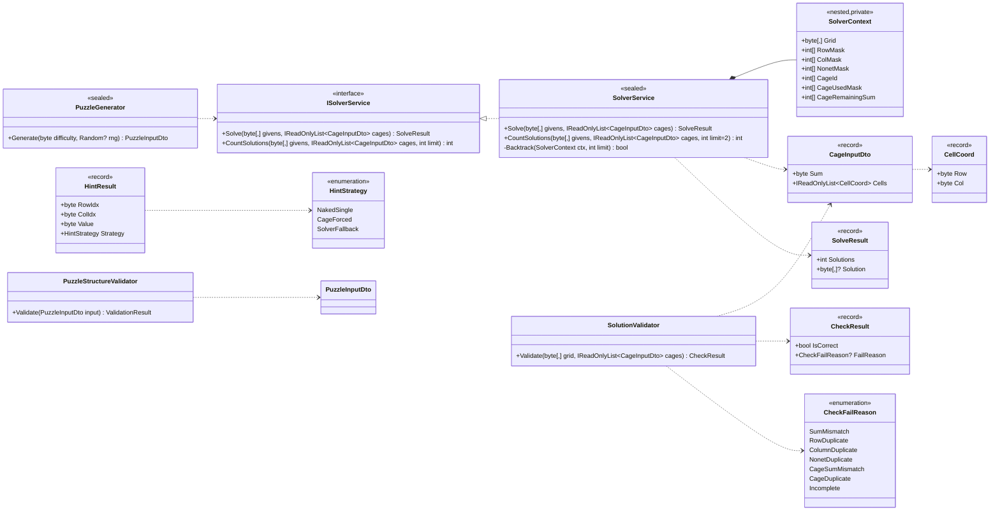
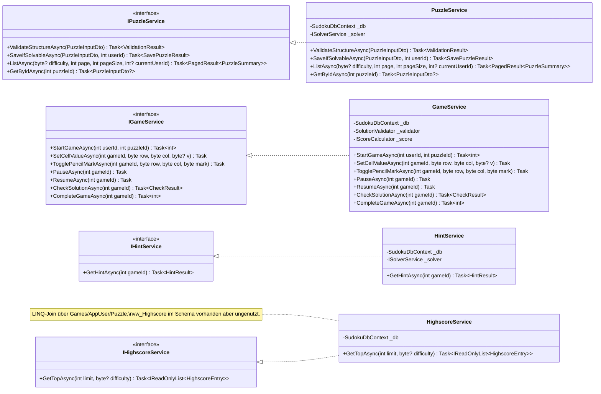
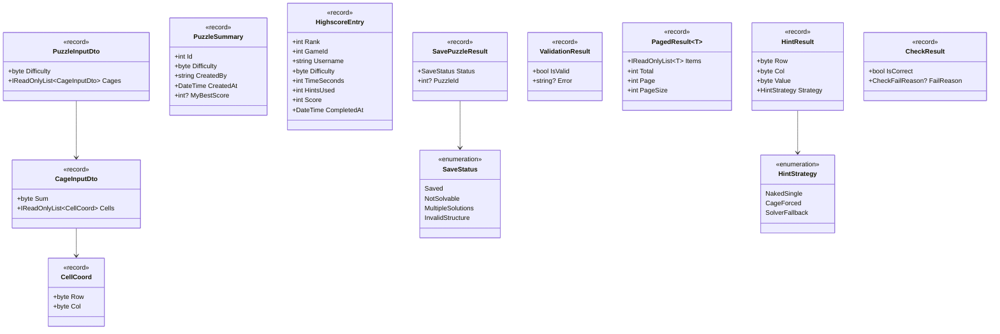
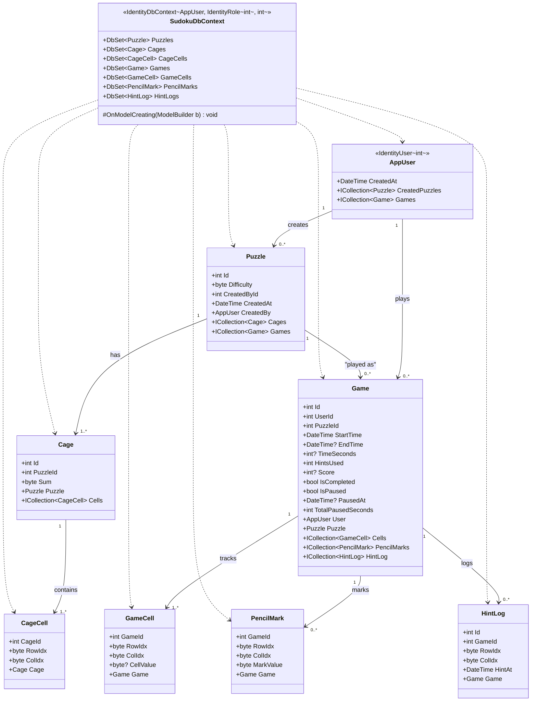
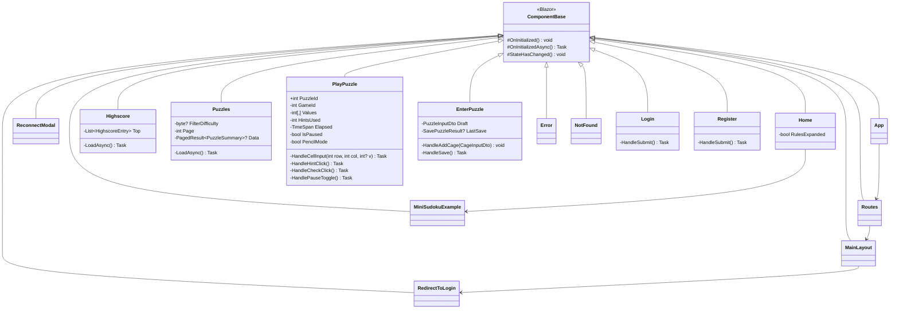

# Class Diagram — Killer Sudoku

> **Spec-Bezug:** Pflicht-Sektion gemäss `skillsbattle2026_1.1.md` §2.6
> **Stack:** .NET 10, Blazor Server, EF Core 10, MS-SQL Express
> **Querverweise:** [`functionality.md`](functionality.md) (autoritative Service-Signaturen) · [`erm.md`](erm.md) (Daten-Modell) · [`use-cases.md`](use-cases.md)

> **Update-Hinweis:** Dieses Diagramm wurde an den Ist-Code synchronisiert. UC02/UC03 verwenden direkt ASP.NET Core Identity (`UserManager`/`SignInManager`), es existiert kein eigener `IAuthService`. UI-Logik ist inline in den Pages (keine Sub-Component-Razor-Dateien für Grid/Toolbar/Editor).

Das System ist in **drei .NET-Projekte** aufgeteilt, jedes Projekt = ein Layer:

| Projekt | Layer | Verantwortung |
|---------|-------|---------------|
| `KillerSudoku.Web` | Presentation | Blazor Server Pages + Components |
| `KillerSudoku.Core` | Application + Domain | Services + reine Sudoku-Algorithmik |
| `KillerSudoku.Data` | Persistence | EF Core DbContext + Entities |

---

## 1 Übersichts-Klassendiagramm (alle Layer)

```mermaid
classDiagram
    direction TB

    %% ============ PRESENTATION ============
    class PlayPuzzle {
        +int PuzzleId
        +OnInitializedAsync() Task
        -HandleCellInput(int row, int col, int? v) Task
        -HandleHintClick() Task
        -HandleCheckClick() Task
    }
    class EnterPuzzle {
        -PuzzleInputDto Draft
        -HandleSave() Task
    }
    class PuzzleList {
        -int? FilterDifficulty
        -int Page
        -LoadAsync() Task
    }
    class Highscore {
        -List~HighscoreEntry~ Top
        -LoadAsync() Task
    }
    class Login {
        -LoginDto Form
        -HandleSubmit() Task
    }
    class Register {
        -RegisterDto Form
        -HandleSubmit() Task
    }
    class Home {
        +OnInitialized() void
    }
    class PuzzleGrid {
        +int[,] Values
        +Action~int,int,int?~ OnCellInput
    }
    class CageEditor {
        +List~CageInputDto~ Cages
        +Action~CageInputDto~ OnCageAdded
    }
    class HintButton {
        +Action OnClick
    }
    class CheckSolutionButton {
        +Action OnClick
    }
    class PauseButton {
        +bool IsPaused
        +Action OnToggle
    }
    class PencilMarkLayer {
        +Dictionary~Cell,HashSet~int~~ Marks
    }
    class HighscoreTable {
        +IReadOnlyList~HighscoreEntry~ Rows
    }

    %% ============ APPLICATION SERVICES ============
    class IPuzzleService {
        <<interface>>
        +ValidateStructureAsync(PuzzleInputDto) Task~ValidationResult~
        +SaveIfSolvableAsync(PuzzleInputDto, int userId) Task~SavePuzzleResult~
        +ListAsync(byte? difficulty, int page, int pageSize, int? currentUserId) Task~PagedResult~PuzzleSummary~~
        +GetByIdAsync(int puzzleId) Task~PuzzleInputDto?~
    }
    class IGameService {
        <<interface>>
        +StartGameAsync(int userId, int puzzleId) Task~int~
        +SetCellValueAsync(int gameId, byte row, byte col, byte? v) Task
        +TogglePencilMarkAsync(int gameId, byte row, byte col, byte mark) Task
        +PauseAsync(int gameId) Task
        +ResumeAsync(int gameId) Task
        +CheckSolutionAsync(int gameId) Task~CheckResult~
        +CompleteGameAsync(int gameId) Task~int~
    }
    class IHintService {
        <<interface>>
        +GetHintAsync(int gameId) Task~HintResult~
    }
    class IHighscoreService {
        <<interface>>
        +GetTopAsync(int limit, byte? difficulty) Task~IReadOnlyList~HighscoreEntry~~
    }
    class IPuzzleGenerator {
        <<interface>>
        +Generate(byte difficulty, Random? rng) PuzzleInputDto
    }
    class IScoreCalculator {
        <<interface>>
        +Calculate(int timeSeconds, int hintsUsed) int
    }
    class PuzzleService
    class GameService
    class HintService
    class HighscoreService
    class PuzzleGenerator
    class ScoreCalculator
    class AspNetIdentity {
        <<framework>>
        UserManager~AppUser~
        SignInManager~AppUser~
    }

    %% ============ DOMAIN ============
    class ISolverService {
        <<interface>>
        +Solve(byte[,] givens, IReadOnlyList~CageInputDto~ cages) SolveResult
        +CountSolutions(byte[,] givens, IReadOnlyList~CageInputDto~ cages, int limit) int
    }
    class SolverService {
        -Backtrack(SolverContext ctx, int limit) bool
    }
    class SolutionValidator {
        +Validate(byte[,] grid, IReadOnlyList~CageInputDto~ cages) CheckResult
    }
    class PuzzleStructureValidator {
        +Validate(PuzzleInputDto input) ValidationResult
    }
    class PuzzleGenerator {
        +Generate(byte difficulty, Random? rng) PuzzleInputDto
    }
    class ScoreCalculator {
        +Calculate(int timeSeconds, int hintsUsed) int
    }
    note for SolverService "Inline-Hint-Strategien in HintService\n(Naked Single, Cage-Forced, Solver-Fallback);\nkeine eigene HintStrategies-Klasse."

    %% ============ DTOs ============
    class PuzzleInputDto
    class CageInputDto
    class PuzzleSummary
    class CheckResult
    class HintResult
    class SolveResult
    class HighscoreEntry
    class SavePuzzleResult
    class ValidationResult
    class PagedResult~T~
    note for SavePuzzleResult "Register/Login verwenden\nIdentityResult/SignInResult\naus ASP.NET Identity\n(keine eigenen DTOs)"

    %% ============ PERSISTENCE ============
    class SudokuDbContext {
        <<IdentityDbContext>>
        +DbSet~Puzzle~ Puzzles
        +DbSet~Cage~ Cages
        +DbSet~CageCell~ CageCells
        +DbSet~Game~ Games
        +DbSet~GameCell~ GameCells
        +DbSet~PencilMark~ PencilMarks
        +DbSet~HintLog~ HintLogs
        +OnModelCreating(ModelBuilder) void
    }
    class AppUser {
        <<IdentityUser~int~>>
    }
    class Puzzle
    class Cage
    class CageCell
    class Game
    class GameCell
    class PencilMark
    class HintLog

    %% ============ DEPENDENCIES ============
    PlayPuzzle ..> IGameService
    PlayPuzzle ..> IHintService
    PlayPuzzle ..> SudokuDbContext
    EnterPuzzle ..> IPuzzleService
    EnterPuzzle ..> IPuzzleGenerator
    PuzzleList ..> IPuzzleService
    Highscore ..> IHighscoreService
    Login ..> AspNetIdentity
    Register ..> AspNetIdentity

    IPuzzleService <|.. PuzzleService
    IGameService <|.. GameService
    IHintService <|.. HintService
    IHighscoreService <|.. HighscoreService
    ISolverService <|.. SolverService
    IPuzzleGenerator <|.. PuzzleGenerator
    IScoreCalculator <|.. ScoreCalculator

    PuzzleService ..> SudokuDbContext
    PuzzleService ..> ISolverService
    PuzzleService ..> PuzzleStructureValidator
    GameService ..> SudokuDbContext
    GameService ..> SolutionValidator
    GameService ..> IScoreCalculator
    HintService ..> SudokuDbContext
    HintService ..> ISolverService
    HighscoreService ..> SudokuDbContext
    PuzzleGenerator ..> ISolverService

    SudokuDbContext --> AppUser
    SudokuDbContext --> Puzzle
    SudokuDbContext --> Cage
    SudokuDbContext --> CageCell
    SudokuDbContext --> Game
    SudokuDbContext --> GameCell
    SudokuDbContext --> PencilMark
    SudokuDbContext --> HintLog
```

> **Auth-Hinweis:** Es gibt **keinen** eigenen `IAuthService`. UC02 (Register) und UC03 (Login) werden direkt in den Razor-Pages über `UserManager<AppUser>` / `SignInManager<AppUser>` von ASP.NET Core Identity umgesetzt. Logout ist als `POST /logout`-Endpoint in `Program.cs` registriert.

---

## 2 Domain-Kern (KillerSudoku.Core / Domain)

Reine C#-Algorithmik. **Keine** EF-Core- oder Framework-Abhängigkeit — komplett unit-testbar.

**Bemerkungen:**

- `SolverService.Backtrack` ist Backtracking + MRV-Heuristik + Bit-Masken-Repräsentation für Row/Col/Nonet/Cage-Constraints (siehe `Core/Services/SolverService.cs`).
- `CountSolutions(..., limit)` bricht beim Erreichen des Limits ab — Default `limit=2` (Spec UC5: "solution must be unique") → Solutions ∈ {0, 1, 2}.
- **Sum-Check 9 × 45 = 405** ist als Pre-Check inline implementiert (`Core/Services/SolutionValidator.cs` und `Core/Services/SolverService.cs:SolverContext.Create`); keine eigene Methode `CheckSumIs405()`.
- `SolutionValidator.Validate` setzt die vier Killer-Sudoku-Regeln in einer fest definierten Reihenfolge um: Vollständigkeit → Sum=405 → Row/Col/Nonet → Cage-Sum/Cage-Duplikat (FailReason codiert via `CheckFailReason`-Enum).
- **Hint-Strategien (Naked Single / Cage-Forced / Solver-Fallback)** sind nicht als eigene Klasse `HintStrategies` modelliert, sondern als private Methoden in `HintService` (`Data/Services/HintService.cs`).

---

## 3 Application Services (KillerSudoku.Core / Application)

Use-Case-Orchestrierung. Jeder Service implementiert genau ein Interface (für Mocking in Unit-Tests).

**UC-Mapping:** vollständig in [`functionality.md`](functionality.md) §Matrix.

**Wichtige Invarianten:**

| Service | Invariante |
|---------|-----------|
| `PuzzleService.SaveIfSolvableAsync` | persistiert nur wenn `_solver.CountSolutions(...) == 1` (Spec UC5 + UC4 "unique") |
| `GameService.CheckSolutionAsync` | Reihenfolge: (1) `CheckSumIs405`, (2) Row/Col/Nonet, (3) Cage — billig→teuer |
| `GameService.CompleteGameAsync` | Score = `IScoreCalculator.Calculate(TimeSeconds, HintsUsed)`; `TimeSeconds = max(0, (EndTime − StartTime) − TotalPausedSeconds)` |
| `HintService.GetHintAsync` | inkrementiert `Game.HintsUsed`, schreibt `HintLog`-Eintrag |

---

## 4 DTOs / Records (Data Transfer)

Alle DTOs sind C#-`record`s (immutable, `with`-Syntax, value-based equality → erleichtert Unit-Tests).

> **Hinweis:** Register und Login verwenden direkt Identity-`IdentityResult` / `SignInResult` — keine eigenen DTOs im `KillerSudoku.Core/Models`.

---

## 5 Persistence (KillerSudoku.Data / EF Core)

EF Core Entities. Schema = `db/sudoku.sql`, ERD = [`erm.md`](erm.md). FK-Kardinalitäten siehe ERD.

**Bemerkungen:**

- `AppUser` erbt von `IdentityUser<int>` — die Identity-Standardfelder (`UserName`, `Email`, `PasswordHash`, `NormalizedUserName`, `NormalizedEmail`, `EmailConfirmed`, `SecurityStamp`, `ConcurrencyStamp`, `PhoneNumber`, `PhoneNumberConfirmed`, `TwoFactorEnabled`, `LockoutEnd`, `LockoutEnabled`, `AccessFailedCount`) werden geerbt und sind im Diagramm nicht einzeln aufgeführt; siehe [`erm.md`](erm.md).
- **`vw_Highscore` existiert im SQL-Schema** (`db/sudoku.sql`), wird vom DbContext aktuell **nicht** gemappt. `HighscoreService` liest stattdessen mit LINQ-Joins über `Games ⋈ AppUser ⋈ Puzzle`.
- `CageCell` / `GameCell` / `PencilMark` haben **Composite PK** (siehe `sudoku.sql`).
- Trigger `trg_CageCell_UniquePerPuzzle` lebt in SQL (`db/sudoku.sql`), ist **NICHT** im EF-Modell konfiguriert; greift nur, wenn das Schema via Skript aufgesetzt wurde.

---

## 6 Presentation (KillerSudoku.Web / Blazor Server)

Auszug der wichtigsten Pages und Components. Vollständige Component-Liste siehe [`arc42/05-building-blocks.md`](arc42/05-building-blocks.md) §5.2.1.

> **Hinweis:** Die Pages enthalten ihre UI-Logik (Grid, Toolbar, Cage-Editor, Pause-Overlay, Pencil-Marks, etc.) inline; es gibt aktuell keine zusätzlichen Sub-Component-Razor-Dateien. Dies hält den Component-Tree flach — siehe arc42/05 §5.2.1 für Begründung.

---

## 7 Dependency Injection — Registrierungs-Übersicht

```mermaid
flowchart LR
    subgraph DIRoot["Program.cs / DI Container"]
        direction TB
        PS["IPuzzleService → PuzzleService"]:::svc
        GS["IGameService → GameService"]:::svc
        HS["IHintService → HintService"]:::svc
        HighS["IHighscoreService → HighscoreService"]:::svc
        Solver["ISolverService → SolverService (Singleton)"]:::dom
        Score["IScoreCalculator → ScoreCalculator (Singleton)"]:::dom
        Gen["IPuzzleGenerator → PuzzleGenerator (Singleton)"]:::dom
        StructVal["PuzzleStructureValidator (Singleton)"]:::dom
        Validator["SolutionValidator (Singleton)"]:::dom
        Clock["TimeProvider.System (Singleton)"]:::dom
        Ctx["SudokuDbContext (Scoped)"]:::data
        Seeder["PuzzleSeeder (Scoped)"]:::data
        subgraph Identity["ASP.NET Identity"]
            direction TB
            UM["UserManager~AppUser~"]:::sec
            SM["SignInManager~AppUser~"]:::sec
            RM["RoleManager~IdentityRole~int~~"]:::sec
        end
    end

    PS --> Solver
    PS --> StructVal
    GS --> Validator
    GS --> Score
    HS --> Solver
    PS --> Ctx
    GS --> Ctx
    HS --> Ctx
    HighS --> Ctx
    Seeder --> Gen
    Seeder --> Ctx

    classDef svc fill:#e6f3ff,stroke:#1976d2
    classDef dom fill:#fff4e6,stroke:#f57c00
    classDef data fill:#e8f5e9,stroke:#388e3c
    classDef sec fill:#fce4ec,stroke:#c2185b
```

**Lifetime-Konventionen:**

| Kategorie | Lifetime | Begründung |
|-----------|----------|------------|
| Pure Domain (Solver, Validator, ScoreCalculator, Generator) | **Singleton** | Stateless, thread-safe |
| Application Services | **Scoped** | Hängen am `DbContext` (Scoped) |
| `SudokuDbContext` | **Scoped** | EF-Core-Standard, ein Context pro Request |
| Blazor Components | **Transient** (per Render) | Framework-gemanaged |

---

## 8 Test-Klassen-Mapping

Pro produktiver Klasse die zugehörige Test-Klasse:

| Production | Test-Klasse | Framework | Test-Typ |
|-----------|-------------|-----------|----------|
| `SolverService` | `SolverServiceTests` | xUnit | Unit |
| `SolutionValidator` | `SolutionValidatorTests` | xUnit | Unit |
| `HintStrategies` | `HintStrategiesTests` | xUnit | Unit |
| `AuthService` | `AuthServiceTests` | xUnit + EF InMemory | Unit / Integration |
| `PuzzleService` | `PuzzleServiceTests` | xUnit + EF InMemory | Unit / Integration |
| `GameService` | `GameServiceTests` | xUnit + EF InMemory | Unit / Integration |
| `HintService` | `HintServiceTests` | xUnit + Mock Solver | Unit |
| `HighscoreService` | `HighscoreServiceTests` | xUnit + Testcontainer-SQL | Integration |
| `PuzzleGrid.razor` | `PuzzleGridTests` | bUnit | Component |
| `HintButton.razor` | `HintButtonTests` | bUnit | Component |
| `PlayPuzzle.razor` | `PlayPuzzleTests` | bUnit + Mock Services | Component |
| `SudokuDbContext` (Schema) | `SchemaTests` | xUnit + Testcontainer-SQL | Integration |

Vollständige Test-Cases siehe [`test-protocol.md`](test-protocol.md).
