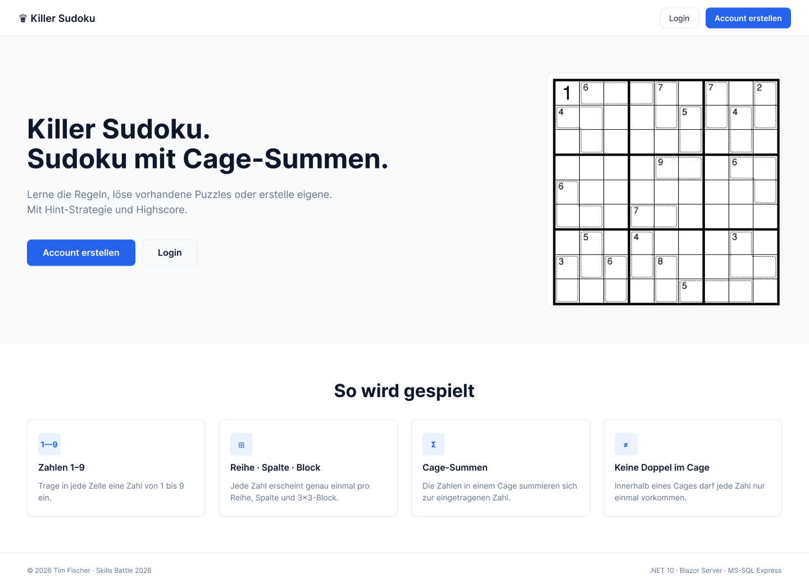
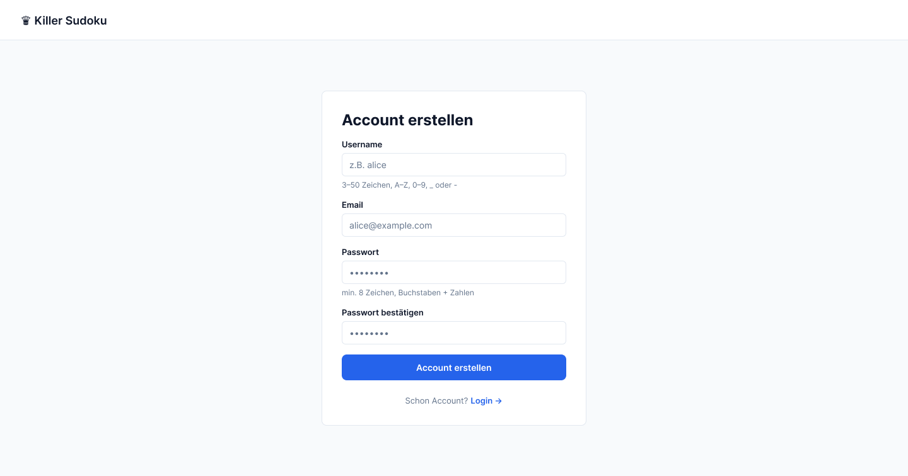
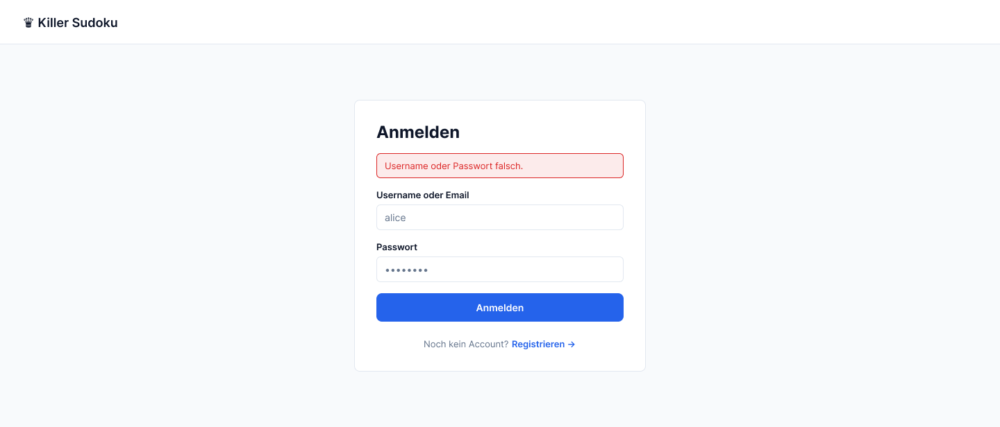
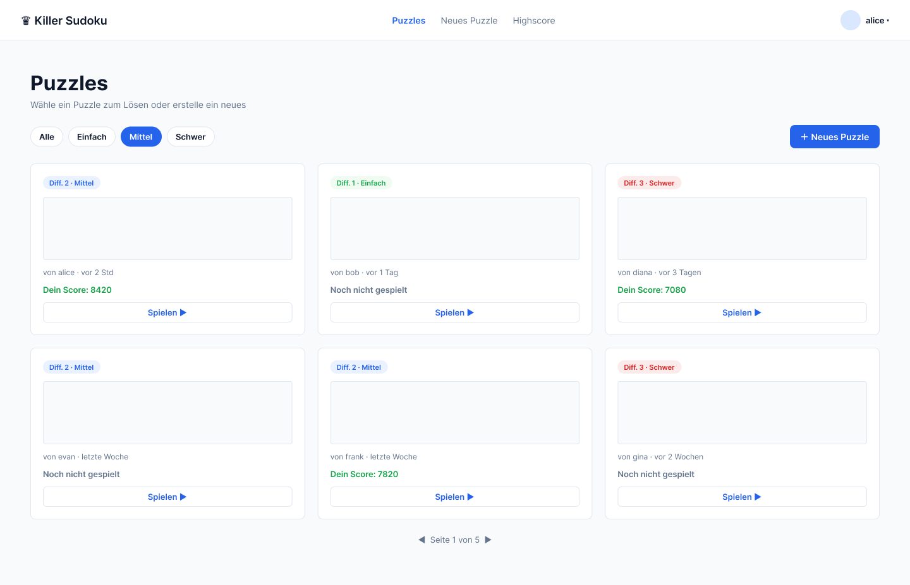
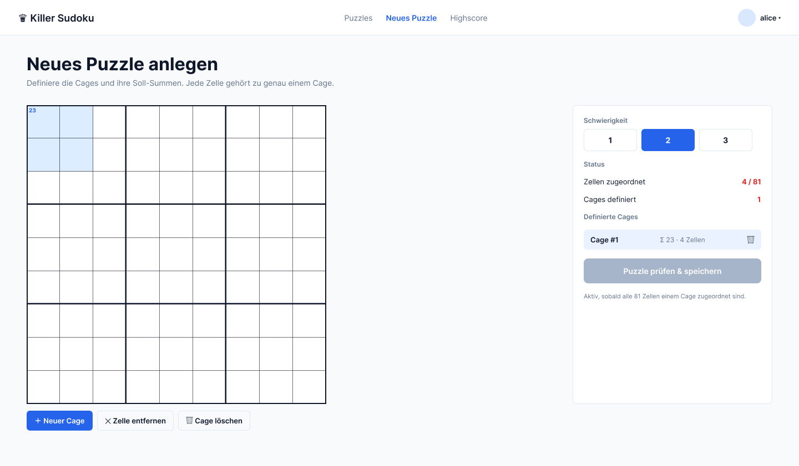
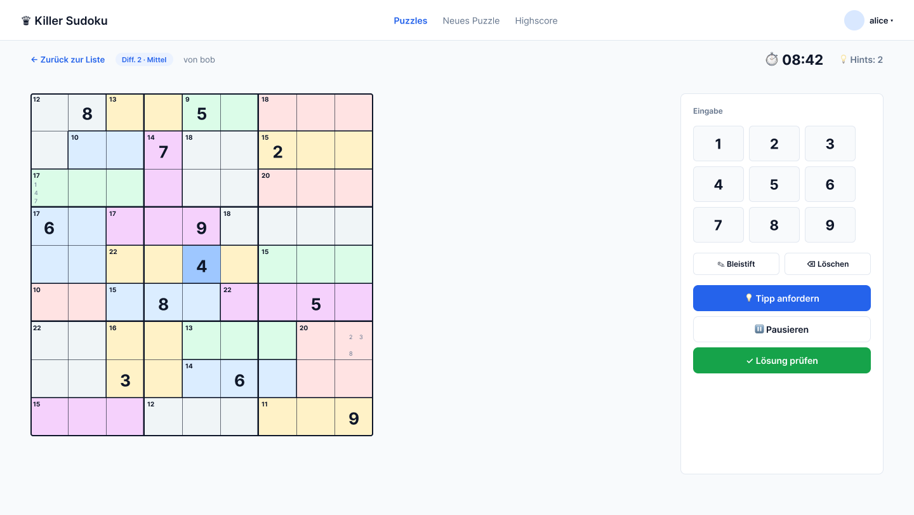
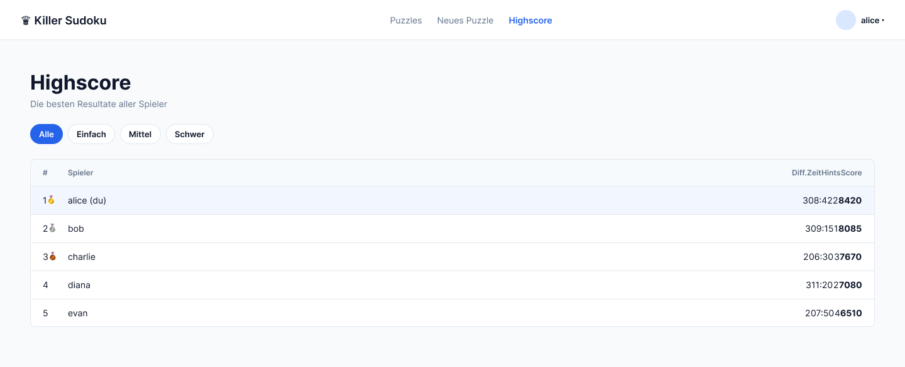

<h1 id="section-1">Sektion 1 — Mockups</h1>

Die folgenden Mockups zeigen die geplante Oberfläche der Killer-Sudoku-Anwendung. Jedes Screen ist auf eine Bildschirmbreite von 1024 px ausgelegt (Desktop-First) und folgt einer gemeinsamen Design-Sprache.

## Design-Sprache

| Element | Wert |
|---|---|
| Primärfarbe | `#2563eb` (Blau) — Buttons, Links, Highlights |
| Hintergrund | `#f8fafc` (helles Grau) |
| Karten-Hintergrund | `#ffffff` |
| Text — Primary | `#0f172a` |
| Text — Muted | `#64748b` |
| Border | `#e2e8f0` |
| Cage-Border | `#475569` gestrichelt |
| Schrift | Inter (Sans-Serif), Monospace für Sudoku-Zellen |
| Spacing-Skala | 4 / 8 / 12 / 16 / 24 / 32 / 48 px |
| Border-Radius | 8 px für Karten und Buttons, 4 px für Inputs, 0 px für Sudoku-Zellen |
| Sticky Header | 64 px Höhe |

## Globale Navigation

| Bereich | Anonym (ausgeloggt) | Eingeloggt |
|---|---|---|
| Header-Logo | "Killer Sudoku" — Link zur Startseite | "Killer Sudoku" — Link zur Startseite |
| Header rechts | Buttons "Register" + "Login" | Username + Buttons "Puzzles", "Highscore", "Logout" |
| Footer | Copyright + Spielregel-Quick-Link | wie anonym |

---

## Screen S1 — Home / Rules

**Use Cases:** UC1 (Read Rules)
**Zugang:** öffentlich

Die Startseite zeigt den Hero-Bereich mit Titel und zwei Call-to-Action-Buttons ("Account erstellen", "Login"), einen Mini-Sudoku als visuellen Eye-Catcher und die vier Spielregeln in einer Card-Reihe. Darunter folgt ein ausgefülltes 9 × 9 Beispiel-Killer-Sudoku zur Demonstration der Cage-Mechanik.

---

## Screen S2 — Register

**Use Cases:** UC2 (Create User)
**Zugang:** öffentlich

Registrierungs-Formular mit den Feldern Username, E-Mail, Passwort und Passwort-Bestätigung. Inline-Validierung pro Feld (siehe Sektion 5 Validation V01–V03). Bei erfolgreicher Registrierung folgt automatisch ein Login und Weiterleitung zur Puzzle-Liste.

---

## Screen S3 — Login

**Use Cases:** UC3 (Login)
**Zugang:** öffentlich

Schlankes Login-Formular mit Username-oder-E-Mail und Passwort. Rate-Limiting nach 5 fehlgeschlagenen Versuchen (siehe Validation V04). Bei Erfolg Weiterleitung zur Puzzle-Liste.

---

## Screen S4 — Puzzle-Liste

**Use Cases:** UC12 (Browse / Filter Puzzles), Einstieg in UC6 (Solve Puzzle)
**Zugang:** Login erforderlich

Übersicht aller gespeicherten Puzzles. Filter-Leiste oben (Difficulty 1/2/3 oder Alle, Sortierung nach Datum oder Schwierigkeit). Jede Karte zeigt Difficulty-Indikator, Ersteller, Erstellungsdatum und gegebenenfalls den eigenen Best-Score. Klick auf "Spielen" startet eine neue Game-Session (UC6). Pagination am Seitenende (20 pro Seite).

---

## Screen S5 — Puzzle-Editor

**Use Cases:** UC4 (Enter Puzzle), UC5 (Save New Puzzle)
**Zugang:** Login erforderlich

Editor zur Eingabe eines neuen Killer-Sudokus. Links das 9 × 9-Grid, rechts ein Panel zur Definition der Cages (Auswahl von Zellen per Klick, Eingabe der Soll-Summe). Difficulty-Pill (1/2/3) oben. Der "Speichern"-Button löst die Solvability-Prüfung aus — Validation prüft, dass genau eine Lösung existiert (siehe Validation V07). Fehler werden inline angezeigt.

---

## Screen S6 — Spielen

**Use Cases:** UC6 (Solve), UC7 (Hint), UC9 (Check Solution), UC10 (Save Result), UC13 (Pause/Resume), UC14 (Pencil Marks)
**Zugang:** Login erforderlich

Haupt-Spielbildschirm. Links der 9 × 9-Grid mit Cage-Strukturen, oben Toolbar mit Timer, Hint-Button (zeigt Anzahl benutzter Hints), Check-Button und Pause-Button. Rechts oder unten der Pencil-Mark-Toggle. Bei Eingabe einer Zahl wird die Zelle aktualisiert; bei aktivem Pencil-Mode werden kleine Kandidaten-Marken gesetzt. Lösung-prüfen führt zuerst den schnellen Summen-Check (405) durch, dann die vollständige Algorithmus-Prüfung. Bei korrekter Lösung wird Zeit und Hint-Anzahl gespeichert und der Score berechnet.

---

## Screen S7 — Highscore

**Use Cases:** UC8 (Show High Score)
**Zugang:** Login erforderlich

Tabellarische Bestenliste. Spalten: Rang, Username, Difficulty, benötigte Zeit, Anzahl benutzter Hints, Score. Sortiert absteigend nach Score. Filterung nach Difficulty optional über die obere Leiste.

---

## Zuordnung Screen × Use Case

| Screen | UC1 | UC2 | UC3 | UC4 | UC5 | UC6 | UC7 | UC8 | UC9 | UC10 | UC11 | UC12 | UC13 | UC14 |
|--------|-----|-----|-----|-----|-----|-----|-----|-----|-----|------|------|------|------|------|
| S1 Home | ● | | | | | | | | | | | | | |
| S2 Register | | ● | | | | | | | | | | | | |
| S3 Login | | | ● | | | | | | | | | | | |
| S4 Liste | | | | | | ○ | | | | | | ● | | |
| S5 Editor | | | | ● | ● | | | | | | | | | |
| S6 Spielen | | | | | | ● | ● | | ● | ● | | | ● | ● |
| S7 Highscore| | | | | | | | ● | | | | | | |

● = Hauptfunktion · ○ = Sekundär-Einstieg

UC11 (Auto-Solve) hat keine eigene UI — der Algorithmus wird intern von UC5 (Solvability-Prüfung) und UC7 (Hint-Generierung) verwendet.
